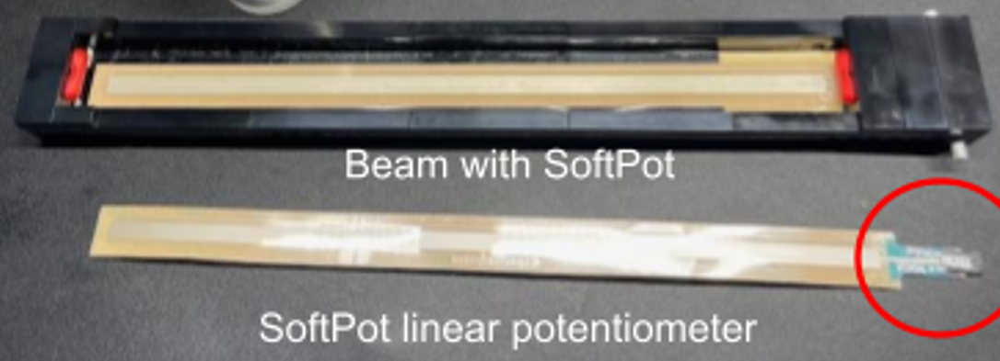
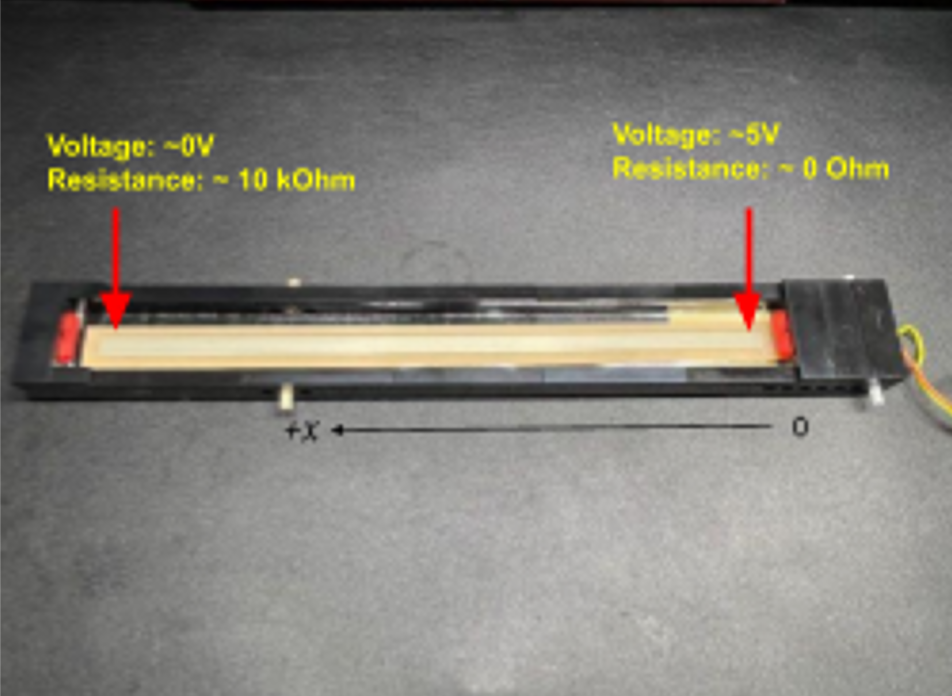

## 우선 목표..
기울어진 Beam 위를 굴러다니는 공의 위치를 Potentiometer 센서로 실시간 측정하고, 이후 이 데이터를 바탕으로 PID/MPC 제어로 서보모터를 조종해 공의 위치를 원하는 곳에 유지하는 것이 최종 목표이다.

일단 이 글에선 센서와 모터를 다룬다.

## Linear Potentiometer
Potentiometer는 가변저항을 의미한다. 이는 "저항 값을 임의로 바꿀 수 있는 전자부품"이라고 한다.   
여기서는 300mm 길이, 10kΩ인 Linear Potentiometer를 사용한다.

<figure style="margin: 0; text-align: center;">
    
    <figcaption>Linear Potentiometer</figcaption>
</figure>

```
이 센서는 저항은 0 ~ 10kΩ, 전압은 0 ~ 5V를 받을 수 있다. 오른쪽 끝에는 5V 전압이 연결되어 있고, 왼쪽 끝에는
GND(0V)가 연결되어 있다. 즉, 공이 오른쪽에 있을 수록 저항이 작아지고, 왼쪽에 있을 수록 저항이 커진다.
```

<figure style="margin: 0; text-align: center;">
    
    <figcaption>Linear Potentiometer</figcaption>
</figure>


Arduino Nano는 전압값만 읽을 수 있기 때문에, 저항값을 전압으로 바꾸는 작업을 해줘야 한다. 

지금 이 기다란 센서 있지 Linear Potentiometer. 여기서 얻는 것이 결국엔 공의 위치값임
근데 그냥 얻는 것은 아니고 저항을 이용해서 전압을 측정함으로써 이 공의 위치를 얻을 수 있는 것임.


센서 자체에서 어떤 정보를 얻는지 이해를 하는 것이 중요한데,

rD, rZ는 전부 `pot_read_position()`으로부터 받는 값인데

```cpp
#define VCC 5.0                  // [V] SoftPot voltage source
#define L 0.3                    // [m] SoftPot length is 0.3 meters
#define METERS_PER_VOLT 0.06     // [m/V] Conversion constant

float pot_read_position(void) {
    // Reads SoftPot OUT value and converts it into a distance
    // Returns distance in [m]
    int raw;                     // [0-1023] 10-bit ADC value
    float volts;                 // [V] acquired voltage
    float ballPosition;          // [m] position on SoftPot
    int pinPot;                  // Nano Pin Name A3 (Pin #22) <-> SoftPot OUT
    
    pinPot = A3;
    raw = analogRead(pinPot);
    volts = (raw / 1023.0) * VCC; // [V] convert to volts (0.0 to 5.0)
    ballPosition = (VCC - volts) * METERS_PER_VOLT; // [m] calculate corresponding meters
    
    return ballPosition;
} // end pot_read_position
```

`pot_read_position()` 자체가 
