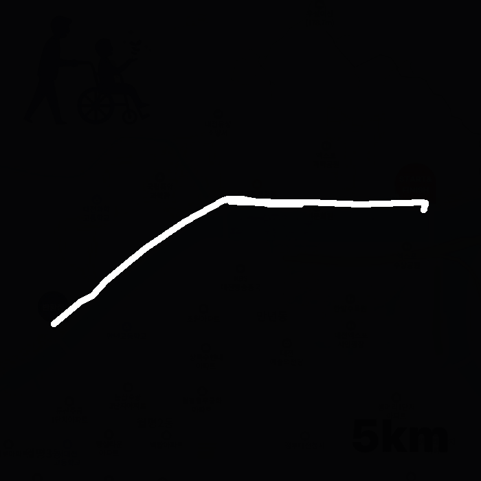
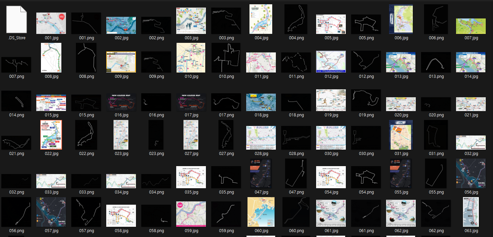
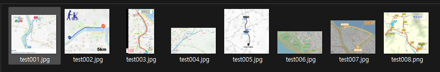

## 프로젝트 설명
현재 우리 캡스톤 프로젝트는 '마라톤 경로 이미지'로부터 GPX 파일을 출력하는 것이다.
GPX 파일은 GPS 데이터를 저장하는 표준 형식으로, 마라톤 경로를 GPS 좌표로 표현한 것이다.

개최측에서 마라톤 GPX 파일을 제공하는 경우가 있기는 하나, 대부분의 경우 GPX 파일을 제공하지 않는다. 또한 마라토너가 직접 GPX 파일을 만들어서 공유하기도 하지만, 직접 GPX를 만드는 것은 수작업으로 매우 번거로운 일이다. 따라서 우리는 AI를 활용하여 마라톤 경로 이미지만 있으면 이를 GPX 파일로 변환할 수 있는 모델을 개발하려고 한다.

이 과정에서 나는 '마라톤 경로 이미지'에서 '경로'를 추출하는 모델을 학습시키고 있다. 즉, 마라톤 경로 이미지에서 픽셀 단위로 '경로'와 '비경로'를 구분하는 이진 분류 문제로 접근하고 있다.
예시는 다음과 같다:

    <figure style="margin: 0; text-align: center;">
        
        <figcaption>원본 마라톤 경로 이미지</figcaption>
    </figure>
    <figure style="margin: 0; text-align: center;">
        
        <figcaption>정답 경로 마스크</figcaption>
    </figure>

## 데이터셋
사실 '마라톤 경로 이미지'와 '정답 경로 마스크' 데이터셋을 구하는 것은 불가능했고, 우리는 직접 데이터를 만들어야 했다. 그래서 우리는 마라톤 경로 이미지를 수집하고, 이를 바탕으로 정답 경로 마스크를 수작업으로 만들어서 데이터셋을 구축했다.

그렇게 총 277개의 '마라톤 경로 이미지'와 '정답 경로 마스크' 쌍을 만들어냈다. 이 데이터셋을 활용하여 모델을 학습시키고, 마라톤 경로 이미지만으로도 GPX 파일을 생성할 수 있도록 하는 것이 우리의 목표이다.

    <figure style="margin: 0; text-align: center;">
        
        <figcaption>학습 데이터셋</figcaption>
    </figure>

 

여기에 추가로 테스트 데이터는 7개의 '마라톤 경로 이미지'와 '정답 경로 마스크' 쌍으로 구성되어 있다. 이 테스트 데이터는 모델의 성능을 평가하는 데 사용될 것이다. 따라서 총 데이터셋은 277개의 학습 데이터와 7개의 테스트 데이터로 구성되어 있다.

    <figure style="margin: 0; text-align: center;">
        
        <figcaption>테스트 데이터셋</figcaption>
    </figure>

