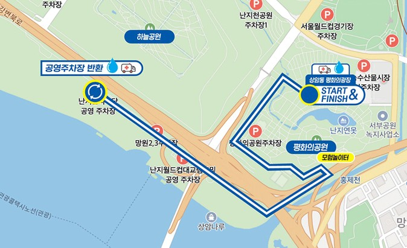
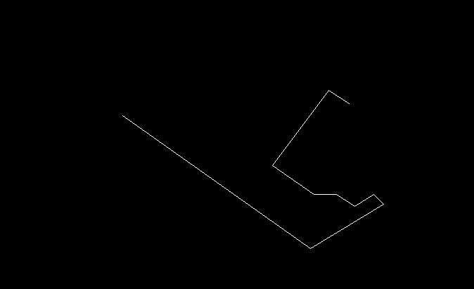
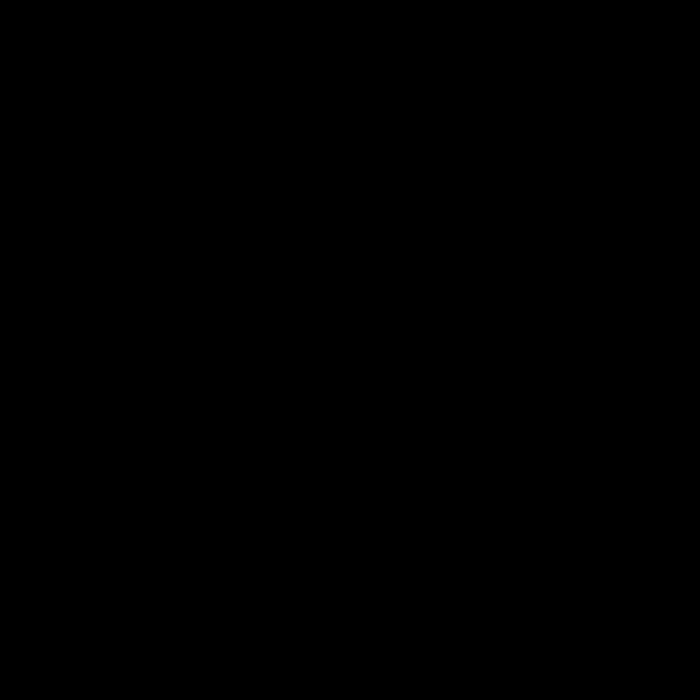

## 프로젝트 개요
현재 우리 캡스톤 프로젝트는 '마라톤 경로 이미지'로부터 GPX 파일을 출력하는 것이다.

이 과정에서 '마라톤 경로 이미지'에서 '경로'를 추출하는 모델을 학습시키고 있다.
예시는 다음과 같다:

    <figure style="margin: 0; text-align: center;">
        
        <figcaption>원본 마라톤 경로 이미지</figcaption>
    </figure>
    <figure style="margin: 0; text-align: center;">
        
        <figcaption>정답 경로 마스크</figcaption>
    </figure>

 
지금은 U-Net 모델을 사용하여 이진 분류 문제로 접근하고 있다.
즉, 각 픽셀에 대해 '경로'인지 '비경로'인지를 예측하는 것이다.

이 모델의 성능을 향상시키기 위해 다양한 Loss 함수를 실험해보고 있다.
1. Binary Cross-Entropy Loss
2. Binary Cross-Entropy Loss + Dice Loss
3. Binary Cross-Entropy Loss + IoU Loss
4. Focal Loss

여기서 동일한 하이퍼파라미터는 다음과 같다:
- Optimizer: Adam
- Learning Rate: 0.0001
- Batch Size: 8
- Epochs: 200
- Train/Validation Split: 222 / 55
- Data Augmentation: Random Rotation, Horizontal Flip
- input size: 512x512
- threshold: 0.5 (모델이 예측한 확률이 0.5 이상이면 '경로', 그렇지 않으면 '비경로'로 분류)

## BCE Loss
가장 먼저 U-Net에 Binary Cross-Entropy Loss를 사용하여 모델을 학습시켰다.
마라톤 경로 이미지에서 픽셀 단위로 '경로'와 '비경로'를 구분하는 문제이므로, BCE Loss가 적절한 선택이라고 생각했기 때문이다.

BCE Loss 식:
$$L_{BCE} = -\frac{1}{N} \sum_{i=1}^{N} [y_i \log(p_i) + (1 - y_i) \log(1 - p_i)]$$
- $N$: 총 픽셀 수
- $y_i$: 실제 레이블 (0 또는 1) / **경로(1), 비경로(0)**
- $p_i$: 모델이 예측한 확률 (0과 1 사이) / **경로일 확률**

예측한 확률 $p_i$에 logarithm을 취하여 실제 레이블과 비교하는 방식으로, 모델이 '경로' 픽셀을 정확히 예측할수록 손실이 줄어든다.

그러나 여기에는 문제점이 있다. 마라톤 경로 이미지에서 '경로' 픽셀은 전체 픽셀 중 극히 일부에 불과하다. 즉, 클래스 불균형이 심한 상황이다. 이로 인해 모델이 대부분의 픽셀을 '비경로'로 예측하는 경향이 생긴다. 결과적으로, loss는 매우 낮게 나오지만, 모델이 예측한 경로 마스크는 실제 경로와 거의 일치하지 않는다.

    <figure style="margin: 0; text-align: center;">
        
        <figcaption>원본 마라톤 경로 이미지</figcaption>
    </figure>
    <figure style="margin: 0; text-align: center;">
        
        <figcaption>모델이 예측한 경로 마스크</figcaption>
    </figure>

 
위의 그림을 보면, 모델이 경로를 거의 에측하지 못하고, 대부분의 픽셀을 '비경로'로 예측하는 것을 알 수 있다.

## BCE Loss에 positive weight 추가
BCE Loss에 positive weight를 추가하여 '경로' 클래스에 더 큰 가중치를 부여하는 방법을 시도해보았다. 이렇게 하면 모델이 '경로' 픽셀을 더 중요하게 학습하도록 유도할 수 있다.

BCE Loss with positive weight 식:
$$L_{BCE} = -\frac{1}{N} \sum_{i=1}^{N} [w \cdot y_i \log(p_i) + (1 - y_i) \log(1 - p_i)]$$
- $w$: positive weight (예: 10)

$w$가 20이라고 가정하고, $p_i$가 0.3인 그리고 $y_i$가 1인 경우를 생각해보자. 이때, '경로' 픽셀에 대한 손실은 다음과 같이 계산된다:
$$L_{BCE} = -\frac{1}{N} \sum_{i
=1}^{N} [20 \cdot 1 \cdot \log(0.3) + (1 - 1) \cdot \log(1 - 0.3)] = -\frac{1}{N} \sum_{i=1}^{N} [20 \cdot (-1.204)] = 24.08$$

이번엔 $p_i$가 0.9인 경우를 생각해보자. 이때, '경로' 픽셀에 대한 손실은 다음과 같이 계산된다:
$$L_{BCE} = -\frac{1}{N} \sum_{i=1}^{N} [20 \cdot 1 \cdot \log(0.9) + (1 - 1) \cdot \log(1 - 0.9)] = -\frac{1}{N} \sum_{i=1}^{N} [20 \cdot (-0.105)] = 2.10$$

이처럼 $w$가 20인 경우, 모델이 '경로' 픽셀을 0.3으로 예측하면 손실이 24.08이 되고, 0.9로 예측하면 손실이 2.10이 된다. 이렇게 하면 모델이 '경로' 픽셀을 예측하는 데 더 큰 패널티를 주게 되어, 모델이 '경로' 픽셀을 더 잘 예측하도록 유도할 수 있다. 

positive weight을 20으로 설정한 결과는 다음과 같다:

    <figure style="margin: 0; text-align: center;">
        
        <figcaption>원본 마라톤 경로 이미지</figcaption>
    </figure>
    <figure style="margin: 0; text-align: center;">
        
        <figcaption>모델이 예측한 경로 마스크</figcaption>
    </figure>

 
positive weight를 추가한 BCE Loss로 모델을 학습시킨 결과, 모델이 '경로' 픽셀을 더 잘 예측하는 것을 확인할 수 있었다. 그러나 여전히 예측된 경로 마스크가 실제 경로와 완전히 일치하지는 않았다.   

## 결론
BCE Loss에 positive weight를 추가하여 모델이 '경로' 픽셀을 예측하는 데 더 큰 패널티를 주도록 했지만, 여전히 예측된 경로 마스크가 실제 경로와 완전히 일치하지는 않았다. 왜냐하면 BCE Loss는 픽셀 단위로 손실을 계산하기 때문에, 모델이 '경로' 픽셀을 예측하는 데 집중하더라도, 전체적으로 예측된 경로 마스크가 실제 경로와 일치하도록 학습시키기는 어렵기 때문이다.

즉, BCE Loss는 픽셀 단위로 손실을 계산하기 때문에, 모델이 '경로' 픽셀을 예측하는 데 집중하더라도, 압도적으로 많은 '비경로' 픽셀을 예측하는 데도 영향을 미치기 때문에, 전체적으로 예측된 경로 마스크가 실제 경로와 일치하도록 학습시키기는 어렵다.

다음에는 BCE Loss에 Dice Loss를 추가하여 모델을 학습시켜보려고 한다. Dice Loss는 클래스 불균형 문제를 완화하는 데 효과적이기 때문에, 마라톤 경로 이미지에서 '경로' 픽셀의 비율이 낮은 상황에서 도움이 될 것으로 기대된다.

