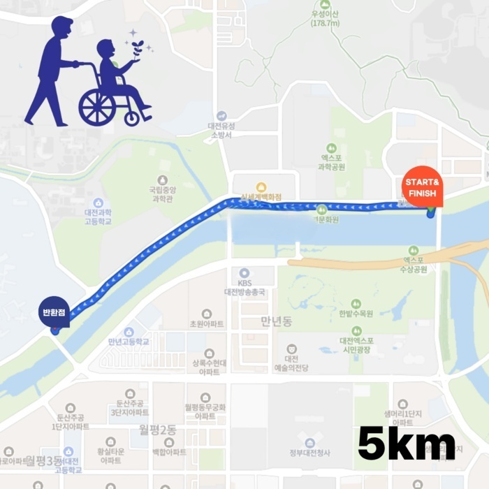
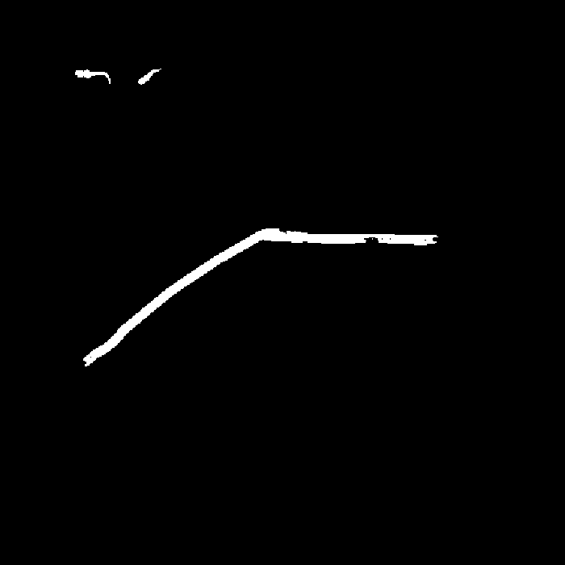
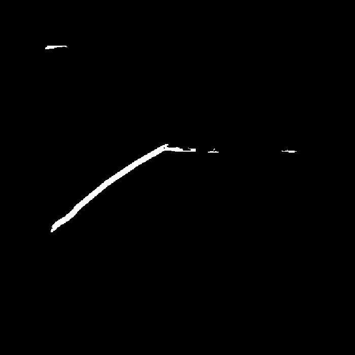
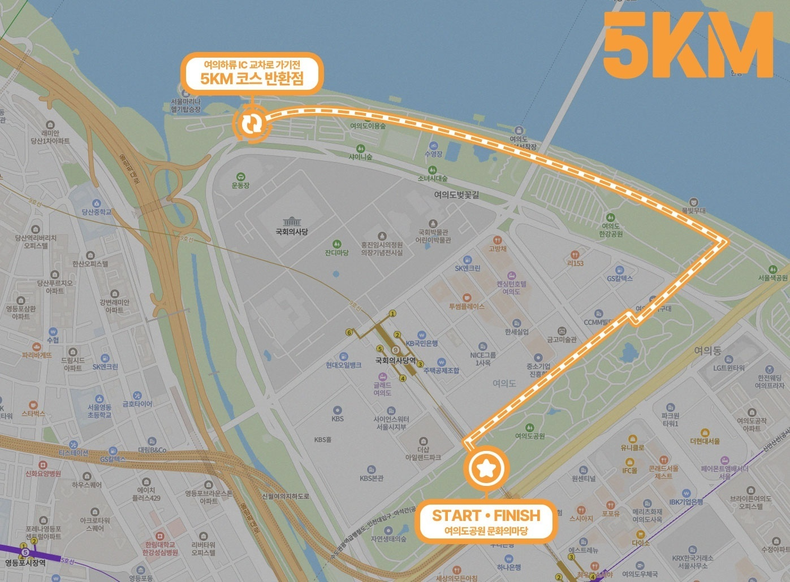
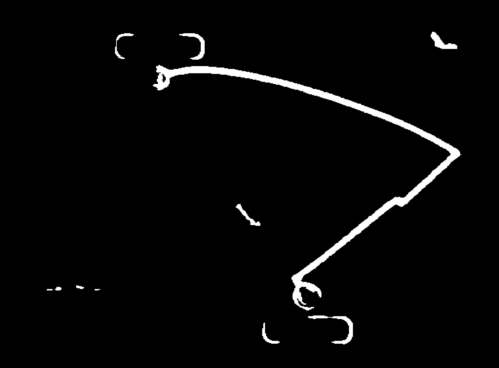
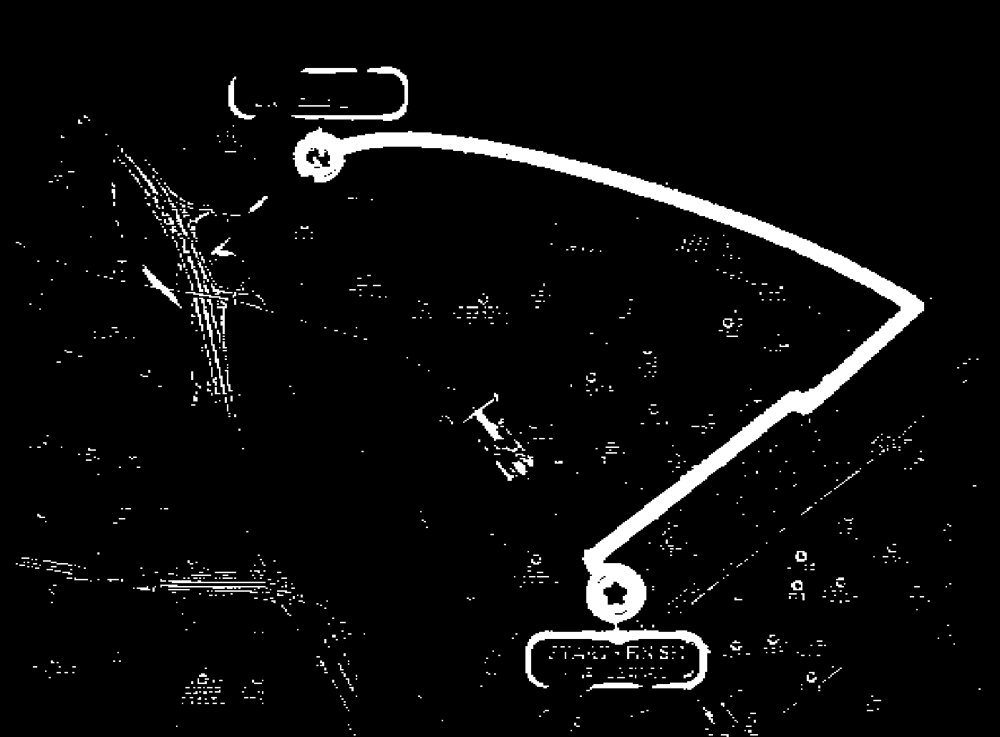
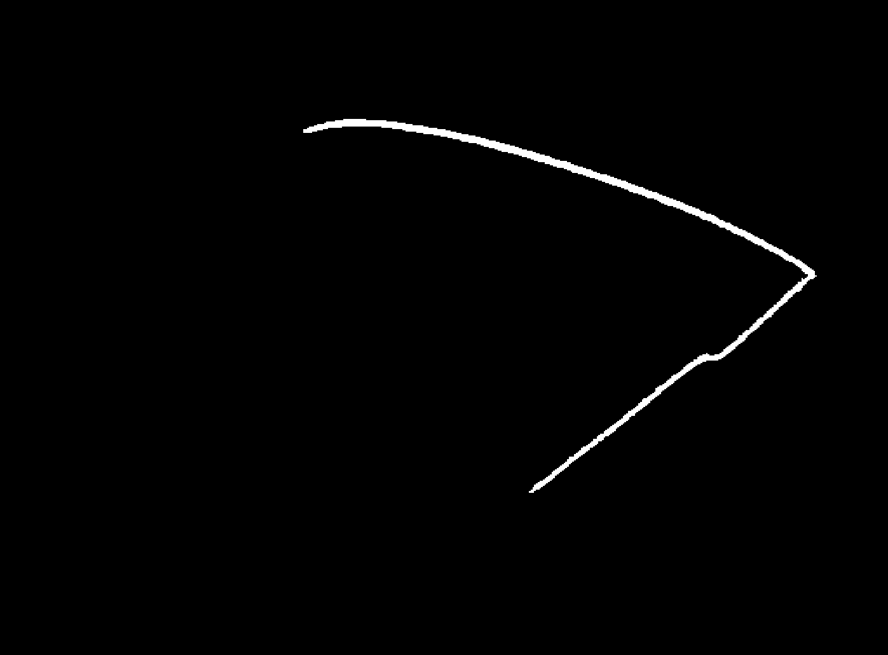

## 개요
마라톤 경로는 전체 이미지에서 차지하는 비율이 극히 적은 불균형한 데이터셋이기 때문에, BCE Loss를 사용하여 모델을 학습시켰지만, BCE Loss는 픽셀 단위로 손실을 계산하기 때문에, 모델이 압도적인 '비경로' 픽셀을 예측하는 데에만 집중하게 되어, '경로' 픽셀을 잘 예측하지 못하는 문제가 발생했다.

positive weight를 추가해도 픽셀 단위로만 판단하는 BCE의 근본적인 한계 때문에, 경로의 전체적인 구조와 연결성을 학습시키기는 어려웠다.

반면, Dice Loss는 픽셀 하나하나가 아닌 전체적으로 예측된 경로 마스크와 실제 경로 마스크가 얼마나 겹치는지를 측정하는 지표이기 때문에, 모델이 '경로' 픽셀을 예측하는 데 집중하도록 유도하면서도, 전체적으로 예측된 경로 마스크가 실제 경로와 일치하도록 학습시킬 수 있다.

따라서 다음 단계로 BCE Loss에 Dice Loss를 추가하여 모델을 학습시켜보려고 한다. Dice Loss는 클래스 불균형 문제를 완화하는 데 효과적이기 때문에, 마라톤 경로 이미지에서 '경로' 픽셀의 비율이 낮은 상황에서 도움이 될 것으로 기대된다.

## Dice Loss
Dice Loss는 모델이 예측한 경로 마스크와 실제 경로 마스크 사이의 유사도를 측정하는 지표인 Dice Coefficient를 기반으로 하는 손실 함수다. Dice Coefficient는 다음과 같이 정의된다:
$$Dice = \frac{2TP}{2TP + FP + FN}$$
- $TP$: True Positives (모델이 '경로' 픽셀을 정확히 예측한 픽셀 수)
- $FP$: False Positives (모델이 '경로' 픽셀로 잘못 예측한 '비경로' 픽셀 수)
- $FN$: False Negatives (모델이 '비경로' 픽셀로 잘못 예측한 '경로' 픽셀 수)

수식을 설명하자면,  실제 경로 영역과 모델이 예측한 경로 영역의 합을 분모로하고, 두 영역이 겹치는 부분(교집합)을 분자로 하여 비중을 계산하는 지표이다. Dice Coefficient는 0과 1 사이의 값을 가지며, 1에 가까울수록 모델이 예측한 경로 마스크와 실제 경로 마스크가 유사하다는 것을 의미한다.

따라서 TP가 많을수록 Dice Coefficient가 높아지고, FP와 FN이 많을수록 Dice Coefficient가 낮아진다. 즉, 모델이 '경로' 픽셀을 정확히 예측할수록 Dice Coefficient가 높아지고, 잘못 예측할수록 낮아진다.

여기서 2를 곱하는 이유는, 모델이 '경로' 픽셀을 정확히 예측한 경우가 FP나 FN보다 더 큰 영향을 미치도록 하기 위해서다. 예를 들어, 모델이 '경로' 픽셀을 10개 정확히 예측하고, 5개를 잘못 예측했다고 가정해보자. 이 경우 TP=10, FP=5, FN=5가 된다. Dice Coefficient는 다음과 같이 계산된다:
$$Dice = \frac{2 \times 10}{2 \times 10 + 5 + 5} = \frac{20}{30} = 0.67$$

만약 2를 곱하지 않는다면, Dice Coefficient는 다음과 같이 계산된다:
$$Dice = \frac{10}{10 + 5 + 5} = \frac{10}{20} = 0.5$$

이렇게 되면 모델이 '경로' 픽셀을 정확히 예측한 경우가 FP나 FN보다 더 큰 영향을 미치도록 할 수 있다. 따라서 Dice Coefficient를 계산할 때 2를 곱하는 것이 일반적이다.

Dice Loss는 Dice Coefficient를 기반으로 하는 손실 함수로, 다음과 같이 정의된다:
$$L_{Dice} = 1 - \frac{2 \sum_{i=1}^{N} p_i y_i + \epsilon}{\sum_{i=1}^{N} p_i + \sum_{i=1}^{N} y_i + \epsilon}$$
- $N$: 총 픽셀 수
- $p_i$: 모델이 예측한 확률 (0과 1 사이) / **경로일 확률**
- $y_i$: 실제 레이블 (0 또는 1) / **경로(1), 비경로(0)**
- $\epsilon$: 작은 상수 (0으로 나누는 것을 방지하기 위해)

Dice Loss는 분모와 문자 모두에서 $y_i=0$인 '비경로' 픽셀은 계산에서 제외된다. 즉, 배경을 아무리 잘 맞춰도 Dice Coefficient에 영향을 미치지 않는다. 
$y_i=1$인 '경로'인 영역을 더 잘 예측할 수록 Dice Coefficient의 분자가 커지므로 Dice Loss가 줄어들게 된다. 따라서 모델이 '경로' 픽셀을 정확히 예측하도록 유도할 수 있다.

> BCE는 픽셀 단위로 손실을 계산하기 때문에 전체적인 경로의 구조와 연결성을 모델이 학습하지 못한다. 그러나 Dice Loss는 전체적으로 예측된 경로 마스크와 실제 경로 마스크가 얼마나 겹치는지를 측정하기 때문에, 모델이 전체적인 경로의 구조와 연결성을 학습하도록 유도할 수 있다.

    <figure style="margin: 0; text-align: center;">
        
        <figcaption>원본 마라톤 경로 이미지</figcaption>
    </figure>
    <figure style="margin: 0; text-align: center;">
        
        <figcaption>모델이 예측한 경로 마스크</figcaption>
    </figure>

BCE Loss보다는 더 잘 예측한 것을 확인할 수 있지만, 여전히 배경에 포함된 '비경로' 픽셀을 함께 '경로' 픽셀로 예측한 것을 볼 수 있다. 

## BCE Loss + Dice Loss
BCE Loss와 Dice Loss를 함께 사용하여 모델을 학습시키는 방법도 있다. 이 경우, 최종 손실 함수는 다음과 같이 정의된다:
$$L = \alpha L_{BCE} + (1 - \alpha) L_{Dice}$$
- $\alpha$: BCE Loss와 Dice Loss의 가중치 (예: 0.5)

BCE Loss와 Dice Loss를 함께 사용하면, 모델이 '경로' 픽셀을 예측하는 데 집중하도록 유도하면서도, 전체적으로 예측된 경로 마스크가 실제 경로와 일치하도록 학습시킬 수 있다.

$\alpha$를 0.5로 설정했을 때의 결과는 다음과 같다:

    <figure style="margin: 0; text-align: center;">
        
        <figcaption>원본 마라톤 경로 이미지</figcaption>
    </figure>
    <figure style="margin: 0; text-align: center;">
        
        <figcaption>모델이 예측한 경로 마스크</figcaption>
    </figure>

아 에바다. 그런데 모든 결과가 이렇게 나오지는 않는다. 어떤 건 확실히 좋아졌고, 위에 처럼 오히려 더 안좋아진 것도 있다. 이를 어떻게 해석해야 할지는 아직 잘 모르겠다.

더 나아진 예시를 보여주자면....

BCE Loss (positive weight = 20) 일 때: 

    <figure style="margin: 0; text-align: center;">
        
        <figcaption>원본 마라톤 경로 이미지</figcaption>
    </figure>
    <figure style="margin: 0; text-align: center;">
        
        <figcaption>모델이 예측한 경로 마스크</figcaption>
    </figure>

 

Dice Loss 일 때:

    <figure style="margin: 0; text-align: center;">
        
        <figcaption>원본 마라톤 경로 이미지</figcaption>
    </figure>
    <figure style="margin: 0; text-align: center;">
        
        <figcaption>모델이 예측한 경로 마스크</figcaption>
    </figure>

 

BCE Loss + Dice Loss ($\alpha = 0.5$) 일 때:

    <figure style="margin: 0; text-align: center;">
        
        <figcaption>원본 마라톤 경로 이미지</figcaption>
    </figure>
    <figure style="margin: 0; text-align: center;">
        
        <figcaption>모델이 예측한 경로 마스크</figcaption>
    </figure>

 

## 결론
BCE Loss의 한계점을 극복하기 위해 Dice Loss를 추가하여 모델을 학습시켜보았다. Dice Loss는 전체적으로 예측된 경로 마스크와 실제 경로 마스크가 얼마나 겹치는지를 측정하는 지표이기 때문에, 모델이 '경로' 픽셀을 정확히 예측하도록 유도할 수 있다. 그러나 성능이 엄청나게 좋아지지는 않았고, 어떤 경우에는 오히려 더 안좋아진 것도 있다. 이를 어떻게 해석해야 할지는 아직 잘 모르겠다.