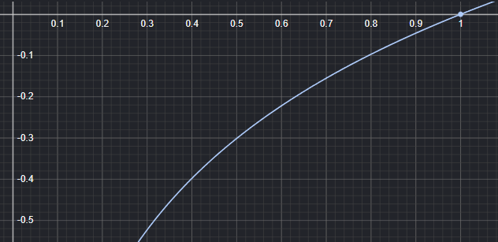
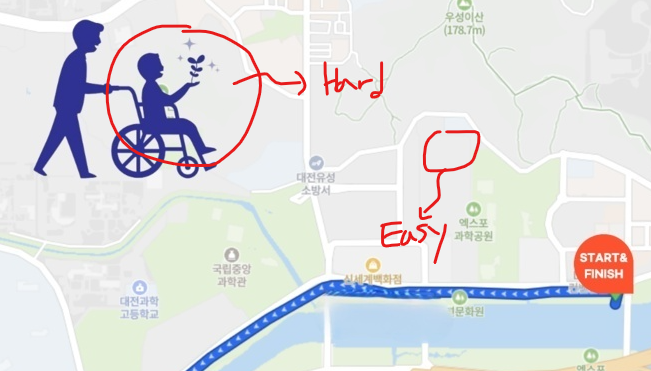

## 개요
### Cross-Entropy Loss의 한계
이진분류에 대한 Cross-Entropy의 식은 다음과 같았다:

$$L_{CE} = -\frac{1}{N} \sum_{i=1}^{N} [y_i \log(p_i) + (1 - y_i) \log(1 - p_i)]$$

$y_i$가 1인 '경로' 그리고 잘 예측되어 $p_i$가 0.8인 경우, 손실은 다음과 같이 계산된다:

$$L_{CE} = - 1 \cdot [1 \cdot \log(0.8) + (1 - 1) \cdot \log(1 - 0.8)] = - \log(0.8) = 0.223$$

반면 $y_i$가 1인 '경로'이지만 모델이 잘못 예측하여 $p_i$가 0.2인 경우, 손실은 다음과 같이 계산된다:

$$L_{CE} = - 1 \cdot [1 \cdot \log(0.2) + (1 - 1) \cdot \log(1 - 0.2)] = - \log(0.2) = 1.609$$

이처럼 Cross-Entropy Loss는 모델이 잘 예측한 경우보다 잘못 예측한 경우에 훨씬 더 큰 손실을 부여한다는 특징이 있다.

    <figure style="margin: 0; text-align: center;">
        
        <figcaption>이해를 돕기 위한 $\log$ 그래프 ('$-$' 붙여서 생각)</figcaption>
    </figure>

 

 

**이제 Cross-Entropy의 문제점에 대해 생각해보자.($p_i$는 모델이 예측한 '경로'일 확률이다.)**

만약 모델이 '경로' 픽셀을 예측한다고 할 때, $y_i$는 1, 그리고 $p_i$는 0.9로 잘 예측했다고 해보자. 이 경우 손실은 다음과 같이 계산된다:

$$L_{CE} = - 1 \cdot [1 \cdot \log(0.9) + (1 - 1) \cdot \log(1 - 0.9)] = - \log(0.9) = 0.105$$

또한 모델이 '배경' 픽셀을 예측한다고 할 때, $y_i$는 0, 그리고 $p_i$는 0.1로 잘 예측했다고 해보자. 이 경우 손실은 다음과 같이 계산된다:

$$L_{CE} = - 0 \cdot [0 \cdot \log(0.1) + (1 - 0) \cdot \log(1 - 0.1)] = - \log(0.9) = 0.105$$

여기서 문제는 **모델이 '경로' 픽셀을 예측하는 경우와 '배경' 픽셀을 예측하는 경우에 동일한 손실을 부여한다는 것이다.**

왜냐하면 마라톤 이미지를 보면 알겠지만, '경로' 픽셀보다 '배경' 픽셀이 훨씬 많기 때문에, 모델이 같은 비율로 Loss를 부여한다면, '배경'에 대해 더 많은 학습이 이루어지기 때문이다. 결국 모델이 '배경' 픽셀을 예측하는 데에만 집중하게 되어, '경로' 픽셀을 잘 예측하지 못하는 문제가 발생한다.

 

**그래서 추가했던 것이 positive weight였다.** positive weight를 추가하여 '경로' 픽셀에 더 큰 가중치를 부여하는 방법을 시도해보았다. 이렇게 하면 모델이 '경로' 픽셀을 더 중요하게 학습하도록 유도할 수 있다.

BCE Loss with positive weight 식:

$$L_{BCE} = -\frac{1}{N} \sum_{i=1}^{N} [w \cdot y_i \log(p_i) + (1 - y_i) \log(1 - p_i)]$$

그러나 단순히 가중치를 곱해주는 방식은 데이터의 '양(Quantity)'과 '질(Quality)'의 차이를 구분하지 못한다는 문제가 있다. 쉽게 말해, '배경'이 '경로'보다 압도적으로 많다는 이유로 단순히 '경로'에 더 큰 패널티를 부여하는 것은 '배경' 픽셀에 대한 예측을 너무 단순화 시키는 것이기 때문이다. 

'배경'에도 '쉬운 배경'이 있고 '어려운 배경'이 있다. 예를 들어 '쉬운 배경'에는 단색으로 되어 있는 부분으로 예측하기 쉽지만, '어려운 배경'에는 '경로'와 유사한 패턴이 있는 부분으로 예측하기 어려운 것이 있다. 즉, **Easy Negative**와 **Hard Negative**가 존재하는 것이다. 
그런데 그저 '배경'이라는 이유로 '경로'보다 작은 패널티를 부여하면 모델이 '쉬운 배경'에 대해서는 잘 예측하지만, '어려운 배경'에 대해 학습할 기회를 잃어버려 잘 예측하지 못하는 문제가 발생할 수 있다.

    <figure style="margin: 0; text-align: center;">
        
        <figcaption>예측하기 쉬운 배경과 어려운 배경</figcaption>
    </figure>

 

이러한 문제점들을 해결하기 위하여 Focal Loss라는 손실 함수를 추가로 사용해보자.

## Focal Loss
Focal Loss는 Easy Negative에 대한 패널티를 줄이고, Hard Negative에 대한 패널티를 증가시키는 방식으로 클래스 불균형 문제를 완화하는 손실 함수이다. Focal Loss의 식은 다음과 같다:

$$L_{Focal} = -\frac{1}{N} \sum_{i=1}^{N} [\alpha \cdot y_i (1 - p_i)^\gamma \log(p_i) + (1 - \alpha) \cdot (1 - y_i) p_i^\gamma \log(1 - p_i)]$$

- $\gamma$: Focusing parameter (예: 2)
- $\alpha$: Balancing parameter (예: 0.25)

여기서 $\gamma$는 쉬운 샘플의 비중을 낮추고 어려운 샘플에 집중하도록 하는 역할을 한다. 이 값이 커질 수록 쉬운 샘플에 대한 패널티가 줄어들고, 어려운 샘플에 대한 패널티가 증가한다.

$\alpha$는 '배경'과 '경로'처럼 클래스 간의 불균형을 조절하는 역할을 한다. 예를 들어, $\alpha$가 0.75로 설정되면, '경로' 클래스에 0.75의 가중치를 부여하고, '배경' 클래스에는 0.25의 가중치를 부여한다. 이렇게 하면 모델이 '경로' 픽셀을 예측하는 데에 더 큰 패널티를 주게 되어, 모델이 '경로' 픽셀을 더 잘 예측하도록 유도할 수 있다.

**$\gamma$가 2, $\alpha$가 0.75일 경우....** 모델이 '배경' 픽셀을 예측할 때를 예시로 들어보자면...

$y_i$가 0이고, $p_i$가 0.1로 잘 예측했다고 해보자. 이 경우 Focal Loss는 다음과 같이 계산된다:

$$L_{Focal} = - (1 - 0.75) \cdot (1 - 0) \cdot 0.1^2 \cdot \log(1 - 0.1) = - 0.25 \cdot 0.01 \cdot \log(0.9) = 0.00025$$

반면 $y_i$가 0이고, $p_i$가 0.45로 '배경'인지 '경로'인지 확신하지 못하여 오답에 가까운 확률을 내놓았다고 가정해보자. 이 경우 Focal Loss는 다음과 같이 계산된다:

$$L_{Focal} = - (1 - 0.75) \cdot (1 - 0) \cdot 0.45^2 \cdot \log(1 - 0.45) = - 0.25 \cdot 0.2025 \cdot \log(0.55) = 0.103$$

**예측이 어려웠던 '배경' 픽셀에 대해서 큰 패널티가 부여된 것을 볼 수 있다.**

 

Cross-Entropy의 경우는 $y_i$가 0이고, $p_i$가 0.1로 잘 예측했다고 해보자. 이 경우 Cross-Entropy Loss는 다음과 같이 계산된다:

$$L_{CE} = - (1 - 0) \cdot \log(1 - 0.1) = - \log(0.9) = 0.105$$

반면 $y_i$가 0이고, $p_i$가 0.45로 '배경'인지 '경로'인지 확신하지 못하여 오답에 가까운 확률을 내놓았다고 가정해보자. 이 경우 Cross-Entropy Loss는 다음과 같이 계산된다:

$$L_{CE} = - (1 - 0) \cdot \log(1 - 0.45) = - \log(0.55) = 0.597$$

**결과적으로 일반 Cross Entropy는 쉬운 배경과 어려운 배경 모두 어느 정도의 패널티를 주지만, Focal Loss는 쉬운 배경의 패널티를 약 400배 이상 극적으로 깎아버린다. 이를 통해 모델은 수많은 '쉬운 배경'을 예측하는 것에 안주하지 않고, '어려운 배경'과 '경로'를 구분하는 데에 에너지를 쏟게 된다.**

$\alpha$: 0.75, $\gamma$: 2로 설정한 결과는 다음과 같다:

    <figure style="margin: 0; text-align: center;">
        
        <figcaption>원본 마라톤 경로 이미지</figcaption>
    </figure>
    <figure style="margin: 0; text-align: center;">
        
        <figcaption>모델이 예측한 경로 마스크</figcaption>
    </figure>

 
결과가 더 안좋다. 이유는 모르겠다. 정말 개화가난다. 열심히 공부하고 실험돌렸는데, 결과가 개판

## 결론
[Project Source Code](https://github.com/sunuk00/capstone-design)

## References 
[Focal Loss for Dense Object Detection](https://arxiv.org/abs/1708.02002)
[https://gaussian37.github.io/dl-concept-focal_loss/](https://gaussian37.github.io/dl-concept-focal_loss/)