# 현 상황과 한계점
지금까지 마라톤 경로 추출을 U-Net 모델을 통해 시도해보았다. 여러 Loss Function을 바꿔가면서, 학습을 진행시켰지만 기대와는 다르게 모델이 '경로' 픽셀을 완벽하게 예측하지 못했다.

    <figure style="margin: 0; text-align: center;">
        
        <figcaption>원본 마라톤 경로 이미지</figcaption>
    </figure>
    <figure style="margin: 0; text-align: center;">
        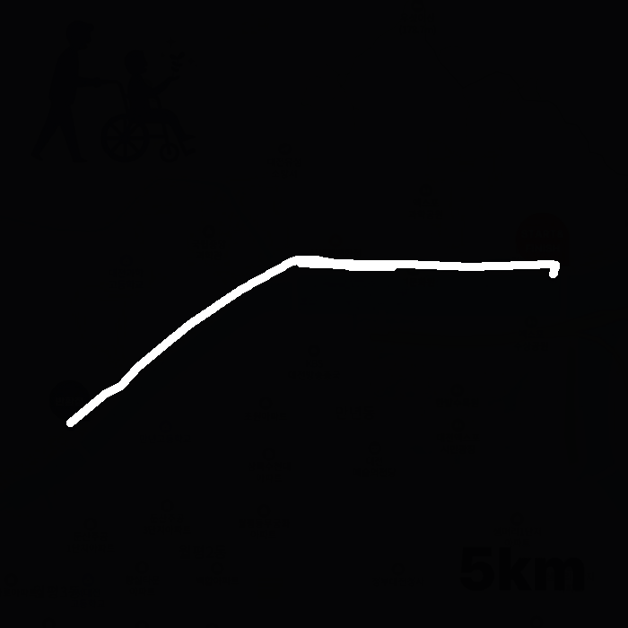
        <figcaption>내가 기대한 모델의 출력</figcaption>
    </figure>
    <figure style="margin: 0; text-align: center;">
        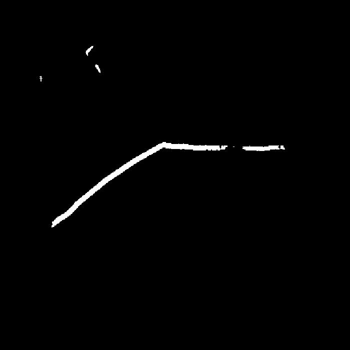
        <figcaption>실제 모델의 출력</figcaption>
    </figure>

 

한가지 걸리는 것은 내가 바꿔본 것은 오직 Loss Function 뿐이었고, 모델의 구조나 하이퍼파라미터는 동일시했기 때문에, 이를 경로 추출을 위한 성능 향상 실험이 완벽했다고는 할 수 없을 것 같다. BCE Loss + Positive Weights, Dice Loss, Focal Loss와 같은 이진분류에 적절한 Loss Function을 사용했고 성능차이가 크게 다르지 않음을 확인했다.

물론 어떤 Loss를 사용하느냐에 따라, 혹은 Loss 함수의 하이퍼파라미터를 어떻게 설정하느냐에 따라 매번 결과가 달라지기도 했다. 예를 들어, 아래와 같이 Focal Loss(α=0.75, γ=2.0)로 학습한 모델의 출력이 BCE Loss + Dice Loss + Positive Weights로 학습한 모델의 출력보다 더 좋게 나오는 경우도 있었고, 반대의 경우도 있었다.

    <figure style="margin: 0; text-align: center;">
        
        <figcaption>원본 마라톤 경로 이미지</figcaption>
    </figure>
    <figure style="margin: 0; text-align: center;">
        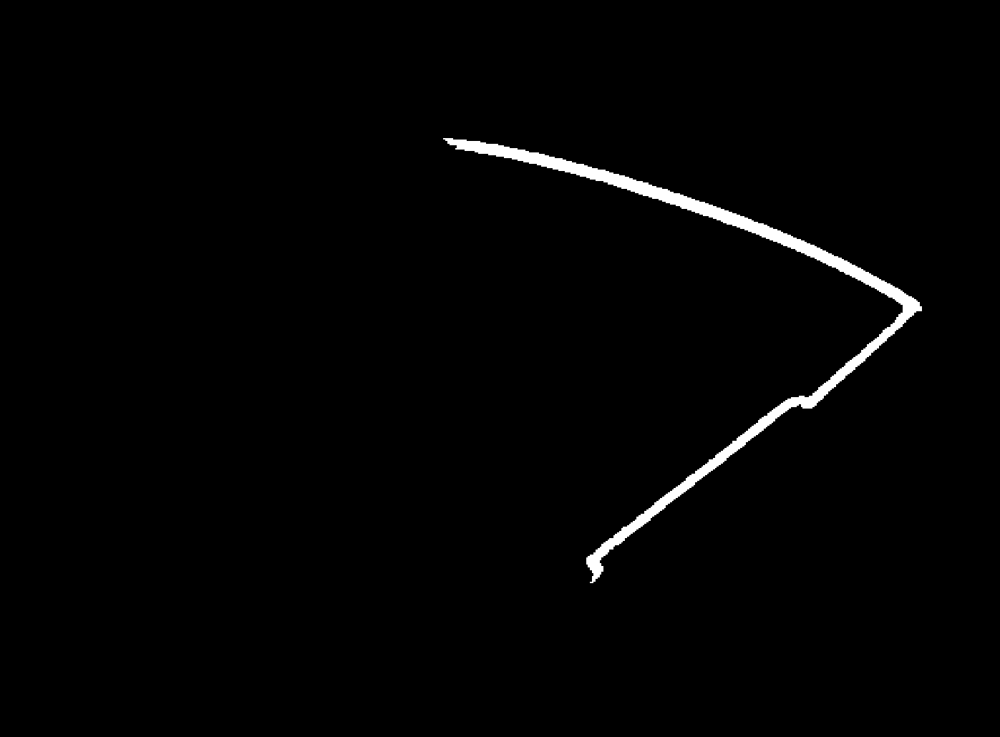
        <figcaption>Focal Loss (α=0.75, γ=2.0) 출력</figcaption>
    </figure>
    <figure style="margin: 0; text-align: center;">
        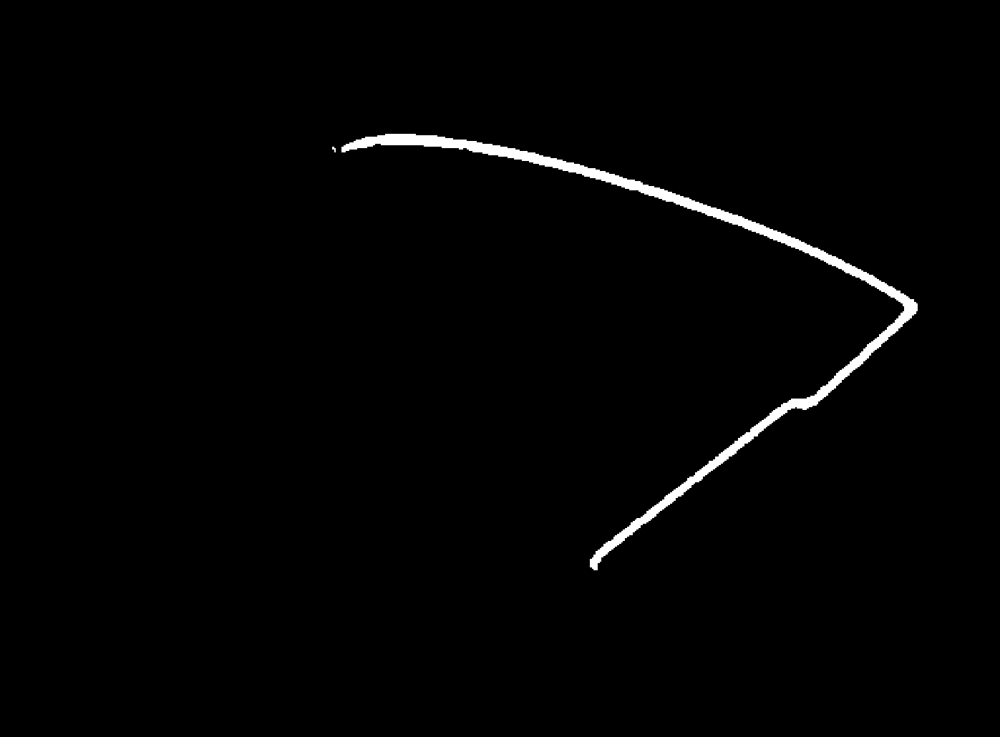
        <figcaption>BCE+Dice Loss (dice=0.7, weight=15) 출력</figcaption>
    </figure>

 

    <figure style="margin: 0; text-align: center;">
        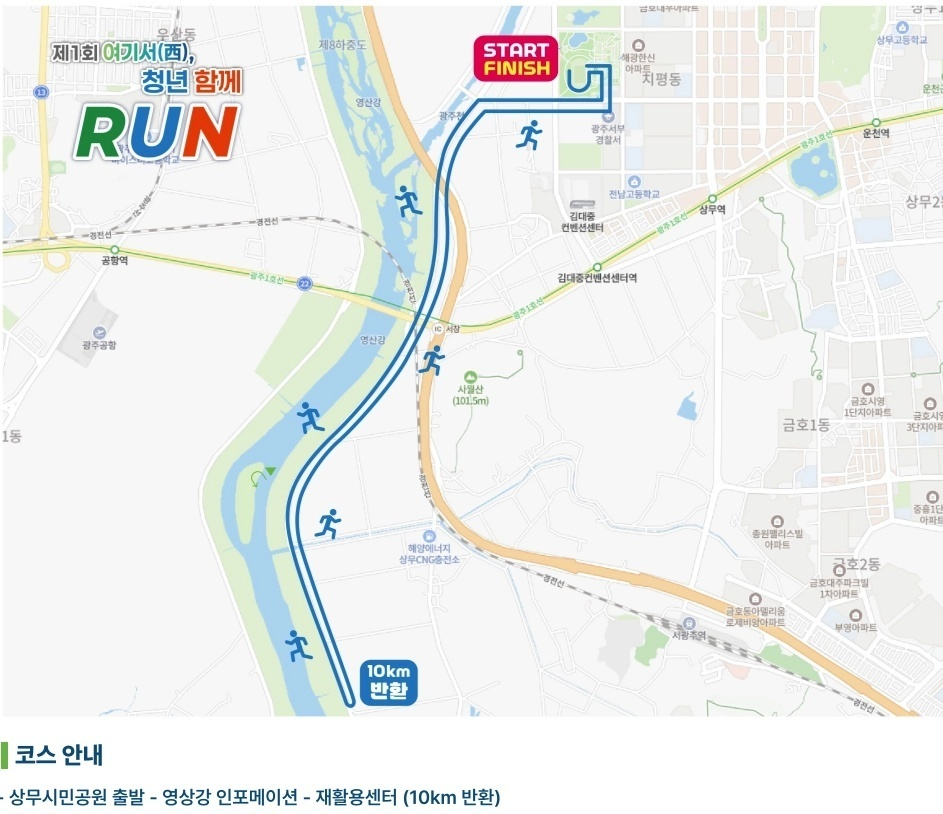
        <figcaption>원본 마라톤 경로 이미지</figcaption>
    </figure>
    <figure style="margin: 0; text-align: center;">
        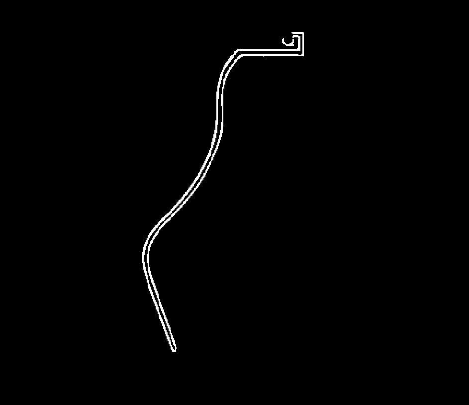
        <figcaption>Focal Loss (α=0.75, γ=2.0) 출력</figcaption>
    </figure>
    <figure style="margin: 0; text-align: center;">
        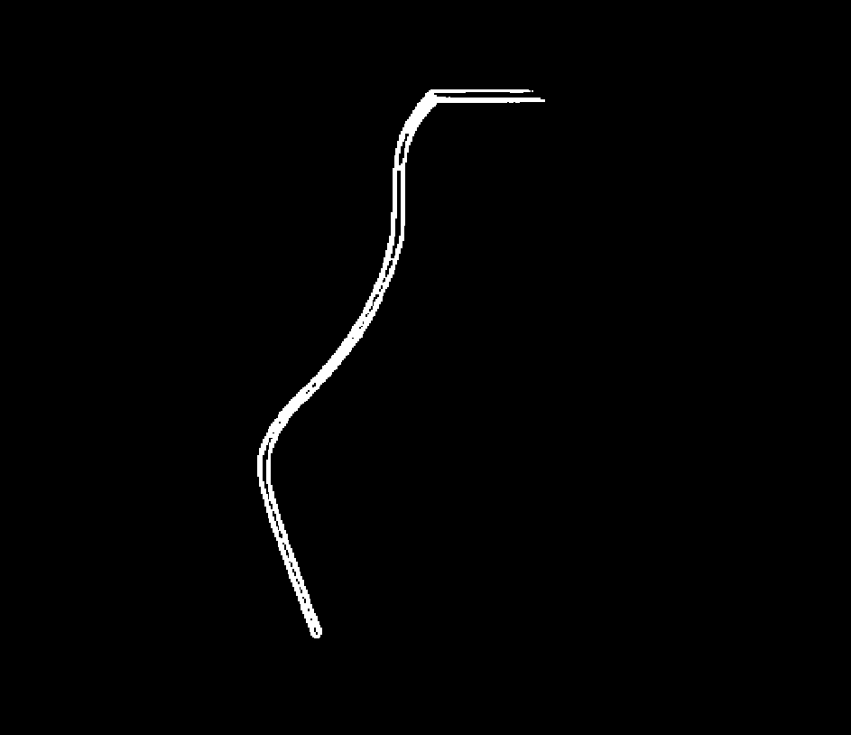
        <figcaption>BCE+Dice Loss (dice=0.7, weight=15) 출력</figcaption>
    </figure>

 

또한 대부분의 실험에서 결과가 항상 좋았던 마라톤 경로 이미지가 있었고, 반대로 항상 좋지 않았던 이미지도 있었다. 이는 모델이 특정 유형의 경로 이미지에 대해서는 잘 학습이 되었지만, 다른 유형의 경로 이미지에 대해서는 일반화가 잘 되지 않았다는 것을 의미할 수 있다.

결과가 거의 항상 좋았던 마라톤 경로 이미지:

    <figure style="margin: 0; text-align: center;">
        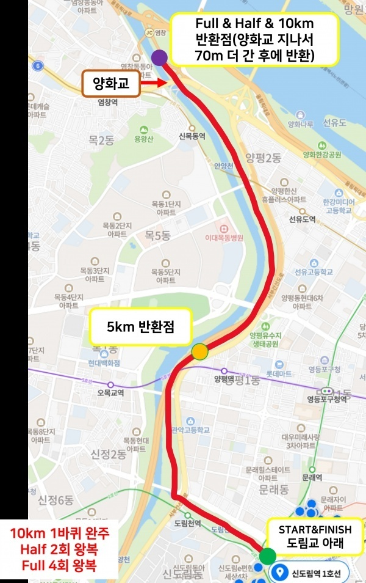
        <figcaption>원본 마라톤 경로 이미지</figcaption>
    </figure>
    <figure style="margin: 0; text-align: center;">
        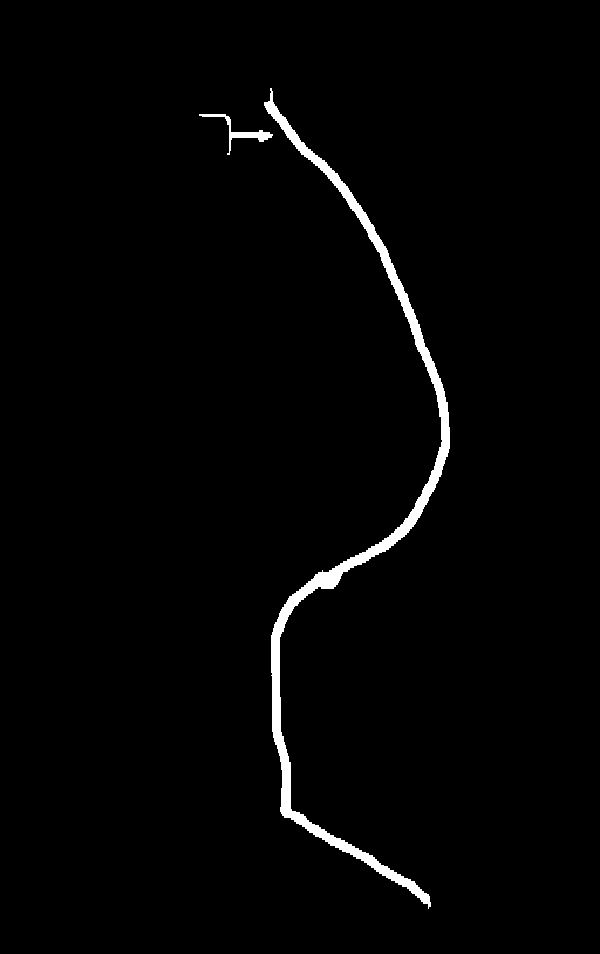
        <figcaption>Focal+Dice Loss (Focal=0.5, α=0.75, γ=2.0) 출력</figcaption>
    </figure>
    <figure style="margin: 0; text-align: center;">
        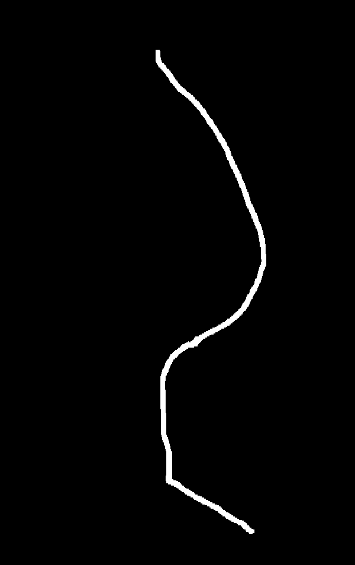
        <figcaption>BCE+Dice Loss (dice=0.7, weight=15) 출력</figcaption>
    </figure>

 

결과가 거의 항상 좋지 않았던 마라톤 경로 이미지:

    <figure style="margin: 0; text-align: center;">
        
        <figcaption>원본 마라톤 경로 이미지</figcaption>
    </figure>
    <figure style="margin: 0; text-align: center;">
        
        <figcaption>Focal+Dice Loss (Focal=0.5, α=0.75, γ=2.0) 출력</figcaption>
    </figure>
    <figure style="margin: 0; text-align: center;">
        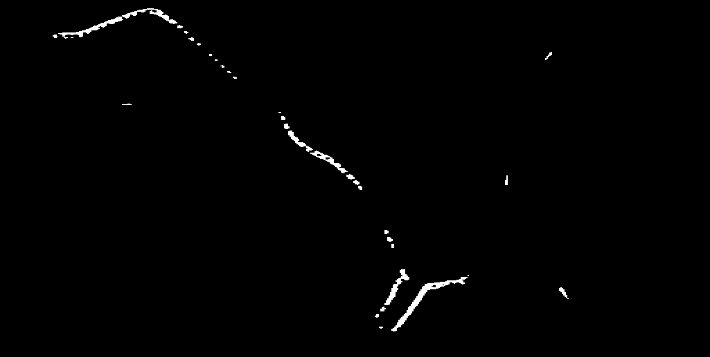
        <figcaption>BCE+Dice Loss (dice=0.7, weight=15) 출력</figcaption>
    </figure>

 

지금까지 실험한 결과를 종합하여 표로 정리하면 다음과 같다:
| Experiment | Loss Function | Hyperparameters | Result Quality |
|------------|---------------|-----------------|----------------|
|01|BCE|0|❌|0.xxx|0.xxx|베이스라인|
|02|BCE|20|❌|0.xxx|0.xxx|
|03|BCE|20|✅|0.xxx|0.xxx|
|04|BCE+Dice|0|✅|0.xxx|0.xxx|
|05|BCE+Dice|10|✅|0.xxx|0.xxx|
|06|BCE+Dice|20|✅|0.xxx|0.xxx|
|09|Focal|15|✅|0.xxx|0.xxx|alpha=0.75, gamma=2.0|
|12|BCE+Dice|0|✅|0.346|0.454|bce:dice = 0.5:0.5|
|17|BCE+Dice|10|✅|0.409|0.518|1px 데이터 제거 후|

이런 느낌으로...

## 왜 이러한 결과가 나오는 것일까?
이렇게 Loss Function을 바꿔가면서 실험을 진행해보았지만, 모델이 모든 마라톤 경로 이미지에 대해서 '경로' 픽셀을 완벽하게 예측하지 못하는 한계점이 존재한다는 것을 알 수 있었다. 

나는 모델이 '경로' 픽셀을 완벽하게 예측하지 못하는 이유는 다음 두 가지가 가장 큰 원인이라고 생각한다:
1. **데이터 양/품질 부족**
2. **이미지 포맷 다양성**

### 데이터 양/품질 부족

### 이미지 포맷 다양성

## 결론

[Project Source Code](https://github.com/sunuk00/capstone-design)