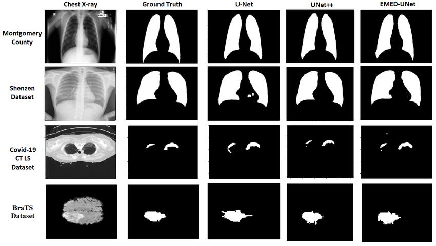
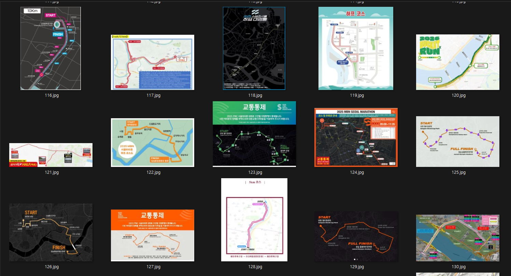
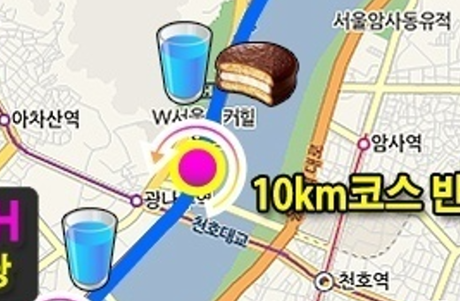
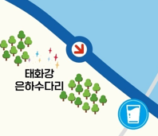
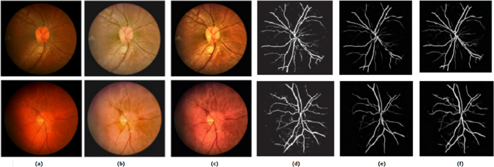

## 현 상황과 한계점
지금까지 마라톤 경로 추출을 U-Net 모델을 통해 시도해보았다. 여러 Loss Function을 바꿔가면서, 학습을 진행시켰지만 기대와는 다르게 모델이 '경로' 픽셀을 완벽하게 예측하지 못했다.

    <figure style="margin: 0; text-align: center;">
        
        <figcaption>원본 마라톤 경로 이미지</figcaption>
    </figure>
    <figure style="margin: 0; text-align: center;">
        
        <figcaption>내가 기대한 모델의 출력</figcaption>
    </figure>
    <figure style="margin: 0; text-align: center;">
        
        <figcaption>실제 모델의 출력</figcaption>
    </figure>

 

한가지 걸리는 것은 내가 바꿔본 것은 오직 Loss Function 뿐이었고, 모델의 구조(U-Net)나 하이퍼파라미터는 동일시했기 때문에, 이를 경로 추출을 위한 성능 향상 실험이 완벽했다고는 할 수 없을 것 같다. BCE Loss + Positive Weights, Dice Loss, Focal Loss와 같은 이진분류에 적절한 Loss Function을 사용했고 성능차이가 크게 다르지 않음을 확인했다.

물론 어떤 Loss를 사용하느냐에 따라, 혹은 Loss 함수의 하이퍼파라미터를 어떻게 설정하느냐에 따라 매번 결과가 달라지기도 했다. 예를 들어, 아래와 같이 Focal Loss(α=0.75, γ=2.0)로 학습한 모델의 출력이 BCE Loss + Dice Loss + Positive Weights로 학습한 모델의 출력보다 더 좋게 나오는 경우도 있었고, 반대의 경우도 있었다.

    <figure style="margin: 0; text-align: center;">
        
        <figcaption>원본 마라톤 경로 이미지</figcaption>
    </figure>
    <figure style="margin: 0; text-align: center;">
        
        <figcaption>Focal Loss (α=0.75, γ=2.0) 출력</figcaption>
    </figure>
    <figure style="margin: 0; text-align: center;">
        
        <figcaption>BCE+Dice Loss (dice=0.7, weight=15) 출력</figcaption>
    </figure>

 

    <figure style="margin: 0; text-align: center;">
        
        <figcaption>원본 마라톤 경로 이미지</figcaption>
    </figure>
    <figure style="margin: 0; text-align: center;">
        
        <figcaption>Focal Loss (α=0.75, γ=2.0) 출력</figcaption>
    </figure>
    <figure style="margin: 0; text-align: center;">
        
        <figcaption>BCE+Dice Loss (dice=0.7, weight=15) 출력</figcaption>
    </figure>

 

또한 대부분의 실험에서 결과가 항상 좋았던 마라톤 경로 이미지가 있었고, 반대로 항상 좋지 않았던 이미지도 있었다. 이는 모델이 특정 유형의 경로 이미지에 대해서는 잘 학습이 되었지만, 다른 유형의 경로 이미지에 대해서는 일반화가 잘 되지 않았다는 것을 의미할 수 있다.

결과가 거의 항상 좋았던 마라톤 경로 이미지:

    <figure style="margin: 0; text-align: center;">
        
        <figcaption>원본 마라톤 경로 이미지</figcaption>
    </figure>
    <figure style="margin: 0; text-align: center;">
        
        <figcaption>Focal+Dice Loss (Focal=0.5, α=0.75, γ=2.0) 출력</figcaption>
    </figure>
    <figure style="margin: 0; text-align: center;">
        
        <figcaption>BCE+Dice Loss (dice=0.7, weight=15) 출력</figcaption>
    </figure>

 

결과가 거의 항상 좋지 않았던 마라톤 경로 이미지:

    <figure style="margin: 0; text-align: center;">
        
        <figcaption>원본 마라톤 경로 이미지</figcaption>
    </figure>
    <figure style="margin: 0; text-align: center;">
        
        <figcaption>Focal+Dice Loss (Focal=0.5, α=0.75, γ=2.0) 출력</figcaption>
    </figure>
    <figure style="margin: 0; text-align: center;">
        
        <figcaption>BCE+Dice Loss (dice=0.7, weight=15) 출력</figcaption>
    </figure>

 

## 왜 이러한 결과가 나오는 것일까?
이렇게 Loss Function을 바꿔가면서 실험을 진행해보았지만, 모델이 모든 마라톤 경로 이미지에 대해서 '경로' 픽셀을 완벽하게 예측하지 못하는 한계점이 존재한다는 것을 알 수 있었다.

나는 모델이 '경로' 픽셀을 완벽하게 예측하지 못하는 이유는 다음 두 가지가 가장 큰 원인이라고 생각한다:

1. **데이터가 너무 다양함**
2. **데이터 수가 적음**

### 데이터 다양성
U-Net 논문에서는 적은 양의 데이터만으로도 높은 성능을 달성할 수 있음을 보여주었지만, 이는 비교적 구조와 형태가 일정한 의료 영상 데이터를 기반으로 한 결과였다. 의료 영상은 촬영 환경과 객체의 형태가 상대적으로 일관되어 있기 때문에, 모델이 학습해야 하는 패턴이 비교적 명확하다.

    <figure style="margin: 0; text-align: center;">
        
        <figcaption>U-Net</figcaption>
    </figure>

 

그러나, 우리의 프로젝트에서 사용한 마라톤 경로 이미지는 이미지마다 색상, 배경 지도, 아이콘, 텍스트, 확대 비율 등이 크게 다르다. 어떤 이미지에서는 경로가 밝은 색으로 표시되고, 다른 이미지에서는 어두운 색이나 배경과 유사한 색으로 표현되기도 한다. 즉, 동일한 ‘경로’ 클래스임에도 시각적 특징이 매우 다양하게 나타난다.

    <figure style="margin: 0; text-align: center;">
        
        <figcaption>다양한 마라톤 경로 이미지</figcaption>
    </figure>

 

또한 일부 이미지에는 방향 표시, 거리 마커, 아이콘과 같은 다양한 기호들이 포함되어 있다. 이러한 요소들은 실제 경로 위에 겹쳐 그려지는 경우가 많아 모델 입장에서 경로의 연속성을 방해하는 노이즈로 작용할 수 있다. 그 결과 모델이 해당 영역을 배경으로 잘못 분류하면서, 실제로는 이어져 있어야 할 경로가 끊긴 것처럼 예측되는 현상이 발생한다.

    <figure style="margin: 0; text-align: center;">
        
        <figcaption></figcaption>
    </figure>
    <figure style="margin: 0; text-align: center;">
        
        <figcaption></figcaption>
    </figure>
    <figure style="margin: 0; text-align: center;">
        
        <figcaption></figcaption>
    </figure>

### 데이터 수
데이터 수의 부족 역시 중요한 원인 중 하나라고 볼 수 있다. U-Net은 적은 데이터에서도 비교적 좋은 성능을 보이는 모델로 알려져 있으며, 논문에서도 데이터 증강(Data Augmentation)을 적극 활용하여 한정된 데이터 환경을 극복하였다. 그러나 이는 데이터의 분포가 비교적 일정하다는 전제가 있었기 때문에 가능했던 결과라고 생각한다.

반면 우리의 프로젝트의 데이터셋은 이미지 유형의 편차가 매우 크다. 따라서 모델이 다양한 상황을 모두 학습하고 일반화하기 위해서는 훨씬 더 많은 데이터가 필요하다. 현재의 데이터 수만으로는 다양한 색상, 배경, 기호 조합에 대한 충분한 패턴을 학습하기 어려웠을 가능성이 크다.

특히 segmentation 문제에서는 픽셀 단위의 정밀한 예측이 요구되기 때문에, 특정 형태의 경로나 배경 조합이 학습 데이터에 충분히 포함되지 않으면 새로운 이미지에서 쉽게 오분류가 발생할 수 있다. 즉, 데이터의 다양성은 높은데 데이터 수는 충분하지 않다는 점이 모델 성능의 주요 한계로 작용했다고 볼 수 있다.

## 결론
U-Net 자체가 이렇게 데이터가 다양한 경우에 적합하지 않은 모델일 수도 있겠다는 생각이 든다. 따라서 Segformer나 DeepLabV3+와 같은 다른 모델을 시도해보는 것도 좋은 방법일 수 있다. 또한, 데이터 수가 부족한 문제를 해결하기 위해서는 더 많은 데이터를 수집하거나, gray-scale로 변환하여 색상에 대한 의존도를 줄이는 등의 데이터 전처리 방법을 시도해볼 수도 있을 것이라는 생각이 든다.

[Project Source Code](https://github.com/sunuk00/capstone-design)