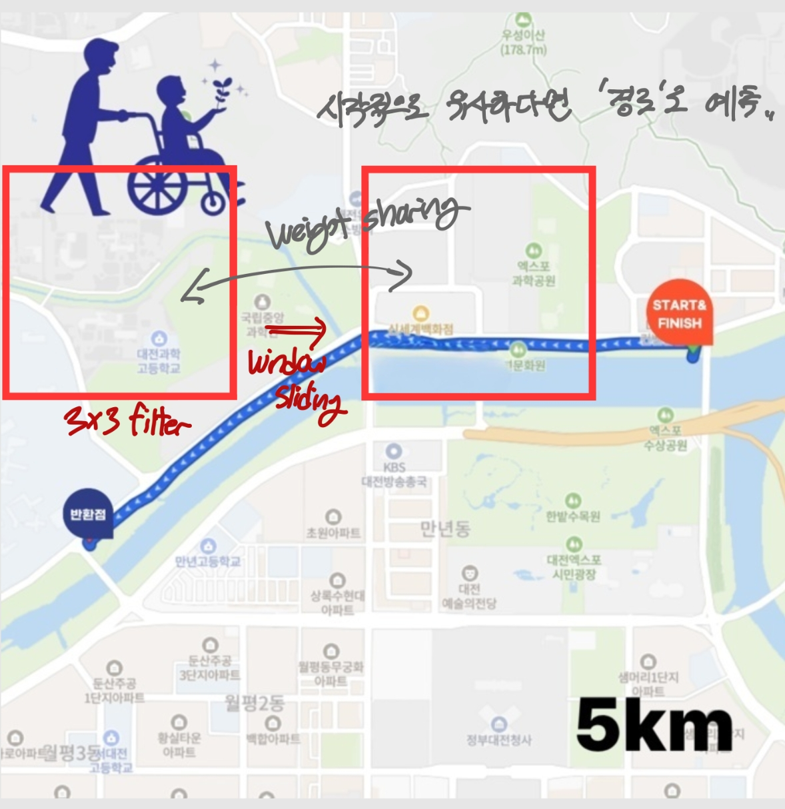
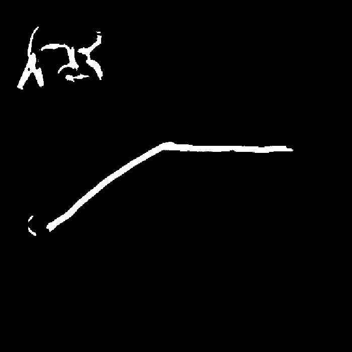
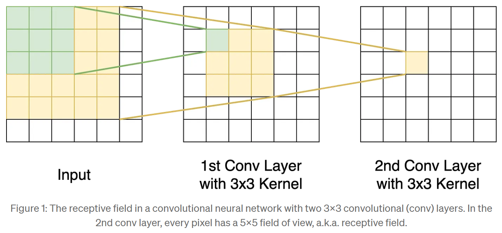
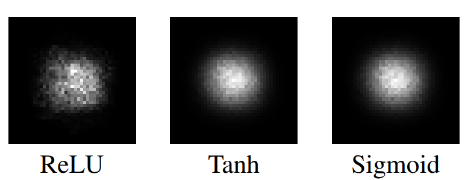
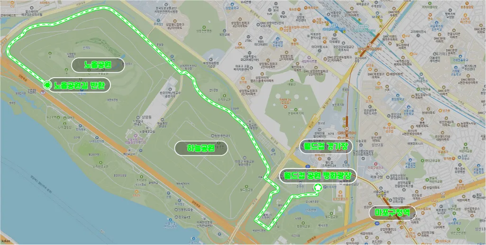
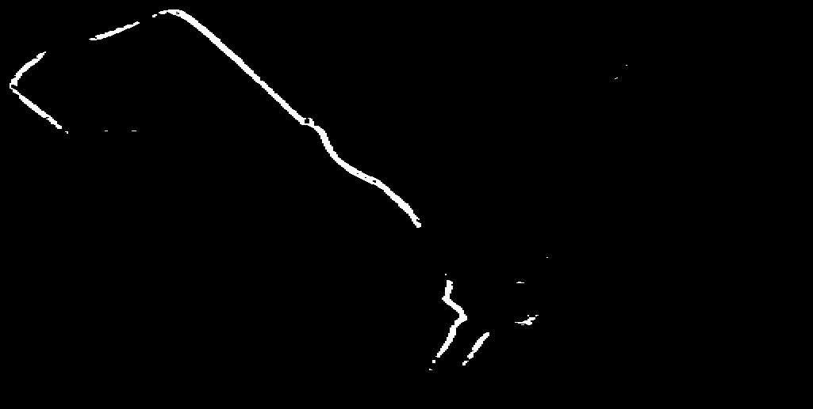
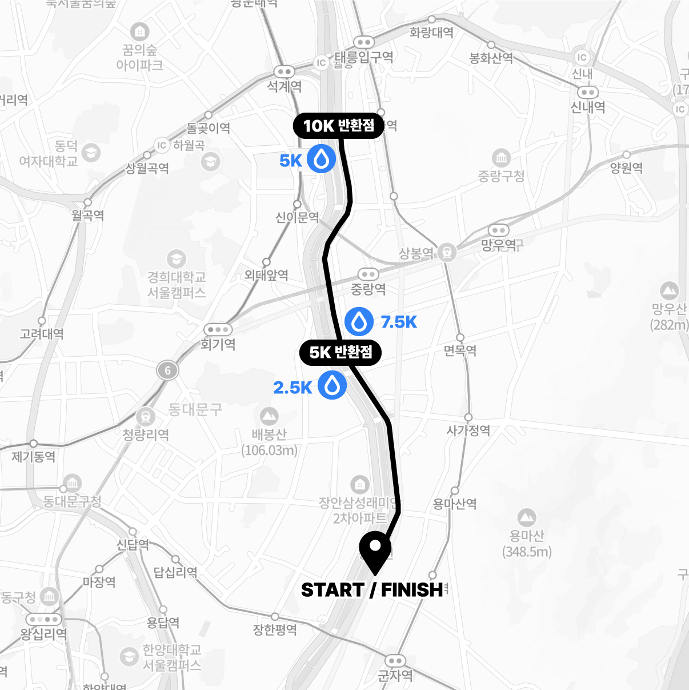
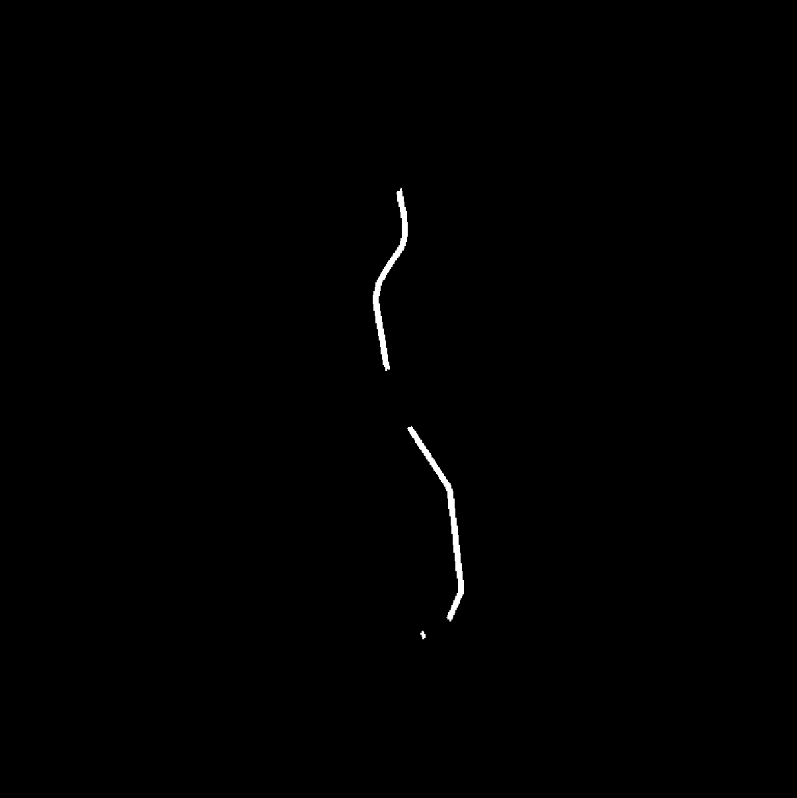

## 개요
마라톤 경로 이미지에서 '경로' 픽셀을 segmentation을 하기 위해, 이러한 task의 대표 모델인 U-Net을 사용하여 학습을 시켰지만, 성능이 좋지 못했다. 

다양한 Loss 함수와 augmentation을 적용해보았고, 합성 데이터도 만들어서 학습을 시켜 보았음에도 대부분 성능이 좋지 못했다. 즉, 결국 U-Net 모델의 구조적 한계 때문에, 마라톤 경로 이미지에서 '경로' 픽셀을 정확히 예측하는 데 어려움이 있다고 판단했다.

물론 ["마라톤 경로 추출의 한계점과 원인 분석"](https://sunuk00.github.io/Projects/Capstone/2026-05-13.html)에서 언급했듯이, 데이터의 다양성은 높은데 데이터 수는 충분하지 않다는 점 또한 모델 성능이 나오지 않은 주된 원인이라고 생각한다.

어쨌든 이번에는 U-Net 모델의 구조적 한계에 대해 분석해보고자 한다.

U-Net이 궁금하다면 ["U-Net 논문 리뷰"](https://sunuk00.github.io/Papers/2026-03-23-UNet.html)를 참고

## U-Net의 구조적 한계
U-Net에는 두 가지 구조적 한계가 존재한다. 첫 번째는 CNN의 Inductive Bias이고, 두 번째는  Receptive Field의 한계이다.

먼저 Receptive Field 관점에서 보면, U-Net은 conv와 max pooling을 반복하며 각 출력 픽셀이 참조하는 입력 영역을 점진적으로 넓혀간다. 하지만 이 영역은 레이어 수에 비례해 유한한 크기로 수렴할 뿐, 이미지 전체를 포괄하지 못한다. 만약 모델이 판단해야 할 정보가 이 유한한 영역보다 넓게 퍼져 있다면, 그 정보는 애초에 모델의 입력 범위 밖에 있으므로 학습 자체가 불가능하다.

이러한 Receptive Field의 한계는 사실 CNN이 가진 근본적인 Inductive Bias, 즉 "의미 있는 패턴은 국소적인 픽셀 관계로 구성된다"는 locality 가정에서 비롯된다. CNN은 3x3 conv처럼 정해진 크기의 영역 안에서만 관계를 학습하도록 설계되어 있고, 이 가정은 이미지 전체에 걸쳐 이어지는 전역적 구조(예: 마라톤 경로처럼 가늘고 길게 이어지는 형태)를 파악하는 데 구조적인 제약으로 작용한다.

### CNN의 Inductive Bias
이미 언급했듯이, CNN은 근본적으로 "의미 있는 패턴은 국소적인 픽셀 관계로 구성된다"는 locality 가정을 가지고 있다. 즉, 3x3 conv처럼 정해진 크기의 영역 안에서만 관계를 학습하도록 설계가 되어 있다. 

여기에 뒤따라 오는 개념이 있는데, 바로 **Weight Sharing**이다. CNN은 하나의 layer에서 filter를 sliding하며 학습을 한다. 즉, 한 filter의 weight가 하나의 feature map에 대해 전역적으로 공유가 된다. 이로 인해 weight sharing에는 '같은 패턴은 이미지 내 위치와 무관하게 동일한 방식으로 인식되어야 한다'는 가정이 깔려 있다. 필터는 자신이 지금 이미지의 어느 위치를 보고 있는지 알 수 없기 때문에, 시각적으로 유사한 지역 패턴이라면 그것이 실제 경로이든 다른 객체이든 비슷하게 반응하게 된다.

    <figure style="margin: 0; text-align: center;">
        
        <figcaption>CNN의 window sliding</figcaption>
    </figure>

 

이는 대부분이 비슷한 형태(혹은 분포)를 띠는 데이터셋이면 크게 문제가 되지 않을 수 있지만, 우리 캡스톤 디자인과 같이 데이터의 다양성이 굉장히 큰 '마라톤 경로 이미지' 같은 경우에는 문제가 된다. 왜냐하면 지역 패턴이 서로 다른 의미를 가진 경우가 많기 때문이다. 

예를 들어, 다음 이미지를 보면 왼쪽 위의 파란색 사람 그림과 중앙의 파란색의 길쭉한 경로가 비슷한 형태로 그려져 있다. filter는 이 둘을 비슷한 맥락으로 해석하기 때문에 둘다 경로라고 인식할 가능성이 있다. 실제로 U-Net 대부분의 실험에서 해당 사람 기호를 경로로 인식하는 것이 반복적으로 관찰되었다.

    <figure style="margin: 0; text-align: center;">
        
        <figcaption>Window Sharing</figcaption>
    </figure>
    <figure style="margin: 0; text-align: center;">
        
        <figcaption>모델 출력(약간 극단적인 결과를 일부러 가져옴)</figcaption>
    </figure>

 

> 지금 내 프로젝트 특성상 CNN의 이런 구조가 문제가 된다는 것이지, 실제론 CNN은 Local Connectivity와 Weight Sharing이라는 구조를 통해 적은 수의 파라미터만으로도 공간적인 특징을 효과적으로 학습하고, 동일한 패턴을 위치와 관계없이 안정적으로 인식할 수 있다는 강력한 Inductive Bias를 제공한다. 따라서 일반적인 이미지 분류나 객체 인식과 같이 동일한 패턴이 다양한 위치에서 반복적으로 등장하는 문제에서는 매우 뛰어난 성능을 보인다.

### Receptive Field 한계
CNN의 출력 feature map의 픽셀 하나는 입력 이미지 전체를 보는 것이 아닌, 특정 영역만 참조를 하여 추론을 하게 된다. 이 참조 영역을 Receptive Field라고 한다.

예를 들면 다음과 같다: 
* 1층 conv (3x3): 출력의 한 픽셀 = 입력의 3x3 영역을 봄
* 2층 conv (3x3): 출력의 한 픽셀 = 1층의 3x3을 봄 → 근데 1층의 각 픽셀도 이미 입력의 3x3 영역을 봄
* 2층의 한 픽셀이 1층의 3x3을 보고 있었으니, 결과적으로 입력의 5x5 영역을 보게 됨

이런 식으로 레이어가 깊어질수록 RF는 누적되어 커지게 된다. (아래 이미지 참고)

    <figure style="margin: 0; text-align: center;">
        
        <figcaption>Receptive Field</figcaption>
    </figure>

 

이렇게 layer을 깊이 쌓으면서 Receptive Field를 키울 수는 있지만, 전체 이미지의 맥락을 다 파악할 수 있을만큼 Receptive Field를 크게 키우는 것으로 인해 정확한 경계나 위치를 짚어내는 localization accuracy가 떨어진다. 왜냐하면 Max Pooling/downsampling이 반복될수록 feature map의 공간 해상도가 낮아지기 때문이다.

> 반대로 Layer가 너무 얕으면 Receptive Field가 충분히 확보되지 않아 context 정보를 충분히 활용하기 어렵다.

또한 CNN에서는 Receptive Field의 크기를 떠나서, 실제 예측에 크게 기여하는 것은 훨씬 작은 영역(Effective Receptive Field)에 집중되는 경향이 있다. 

즉, 이론적으로는 RF 내 모든 입력 픽셀이 출력에 영향을 미칠 수 있지만, 실제 학습과 추론 과정에서는 중앙 픽셀이 압도적으로 큰 영향을 미치고 가장자리로 갈수록 영향력이 감소하는 정규 분포 형태를 띤다.

이는 중심에 가까운 픽셀일수록 출력까지 도달하는 연산 경로(path)가 더 많기 때문이며, 결과적으로 RF의 가장자리에 위치한 정보는 이론상 참조 범위 안에 있더라도 실제 예측에는 거의 기여하지 못한다.

이러한 ERF의 특성상, 출력 픽셀은 자신과 가까운 영역의 정보에 크게 의존하고, 멀리 떨어진 영역의 정보는 상대적으로 약하게 반영한다. 따라서 의미를 파악하는 데 필요한 문맥 정보가 ERF보다 넓은 범위에 걸쳐 있는 경우, CNN은 전역적인 관계를 충분히 반영하지 못하는 한계가 발생한다.

    <figure style="margin: 0; text-align: center;">
        
        <figcaption>Activation Function에 따른 ERF의 형태</figcaption>
    </figure>

 
 
이는 '마라톤 경로 이미지'에서 두 가지 양상으로 나타난다. 첫째, 경로가 이미지 전반에 걸쳐 길게 이어지는 경우, 시작 지점과 끝 지점처럼 서로 멀리 떨어진 두 지점 간의 관계를 ERF가 충분히 포괄하지 못해, 하나의 연속된 경로로 통합해서 인식하는 데 어려움을 겪는다. 둘째, 경로가 다른 기호에 가려진 구간에서는 가려지지 않은 주변 영역의 문맥을 활용해 가려진 부분을 추론해야 하는데, 이때 필요한 문맥 정보가 ERF 범위를 벗어나 있으면 해당 구간을 경로로 예측하기 어려워지는 모습을 보인다.

    <figure style="margin: 0; text-align: center;">
        
        <figcaption>경로가 전역적으로 그려져 있음</figcaption>
    </figure>
    <figure style="margin: 0; text-align: center;">
        
        <figcaption></figcaption>
    </figure>
    <figure style="margin: 0; text-align: center;">
        
        <figcaption>기호에 의해 가려진 구간</figcaption>
    </figure>
    <figure style="margin: 0; text-align: center;">
        
    </figure>

 

### 질문) U-Net에는 Skip Connection이 있는데, 이는 이미지의 전역적인 맥락을 파악하는 데 도움을 주지 못하는가?

skip connection은 "넓은 문맥을 보는 능력"을 추가해주는 게 아니라, "위치 정밀도를 복원해주는" 역할을 한다. Skip connection 덕분에 U-Net이 경계선을 뭉개지 않고 비교적 선명하게 segmentation을 만들 수 있는 것이고, 이게 "이미지 전체에 걸친 전역적 관계를 이해하는 능력"을 만들어주는 것은 아니다. 

그 Context를 키우는 것은 bottleneck(가장 깊은 층, 즉 가장 작은 해상도)에 의존하고, 사실 그마저도 ERF 한계 때문에 이론적 RF만큼 전역적이지 못하다.

**🤖AI 왈**       
관점에 따라서는, skip connection이 얕은 층의 "국소적으로 편향된" 정보를 디코더에 직접 주입하기 때문에, 최종 예측이 bottleneck의 (상대적으로 더 넓은) 문맥 정보보다 얕은 층의 국소적 패턴에 더 강하게 좌우될 수 있다는 논점도 가능해요. 이건 마라톤 경로 vs 사람 기호를 헷갈리는 문제(weight sharing에서 얘기했던)와도 연결되는 지점이에요. 국소 패턴만으로는 구분이 안 되는 두 대상이, skip connection을 통해 그 국소적 특징이 그대로 디코더까지 강하게 전달되니까요.

## 결론
CNN의 한계에 대해 알아보았다. 이를 해결해줄 것이라고 기대하는 것은 ViT기반의 Segformer 모델이다.

[Project Source Code](https://github.com/sunuk00/capstone-design)

## References
[U-Net: Convolutional Networks for Biomedical Image Segmentation](https://arxiv.org/abs/1505.04597)  
[Understanding the Effective Receptive Field in Deep Convolutional Neural Networks](https://arxiv.org/abs/1701.04128)