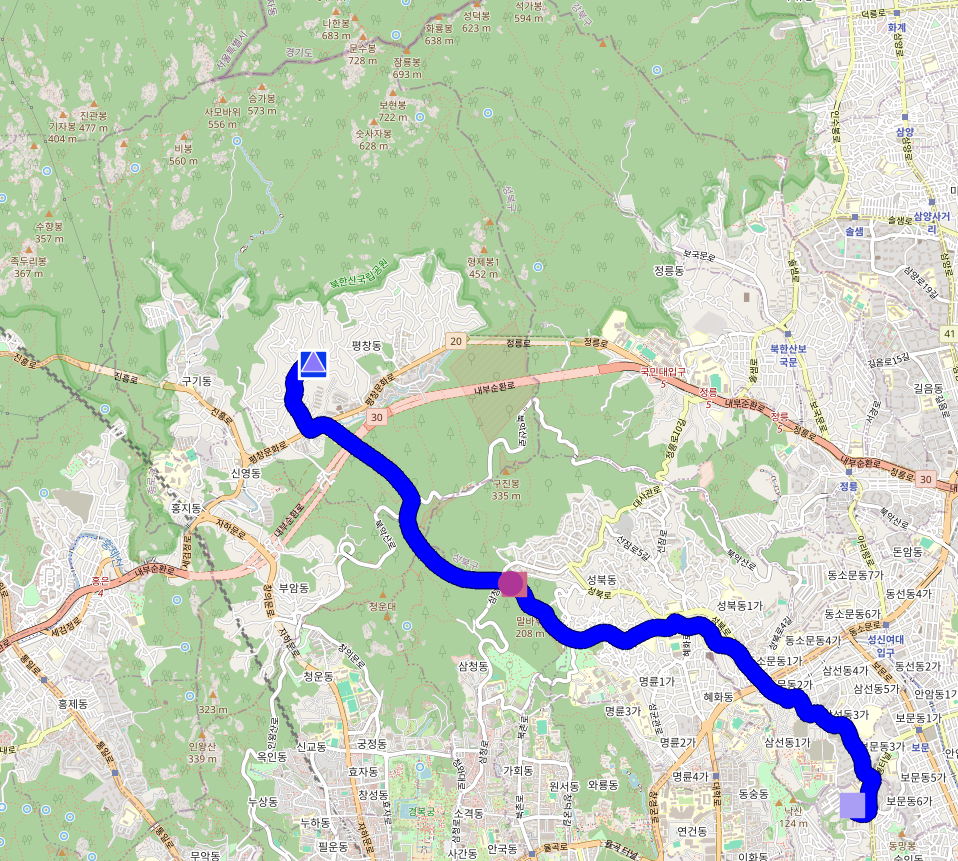
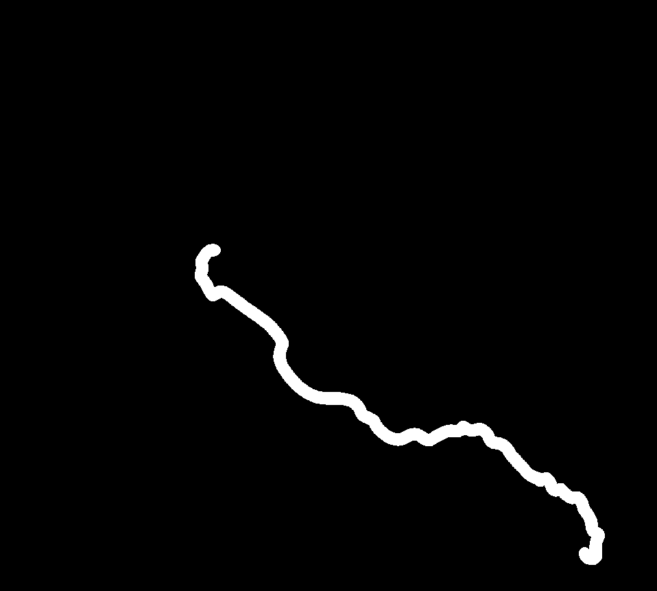
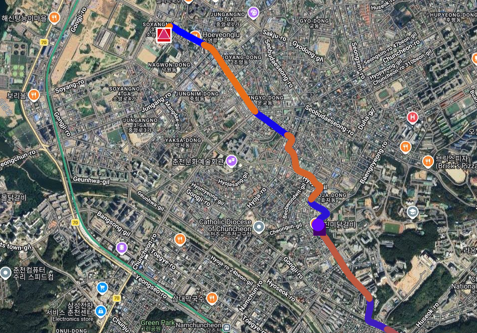
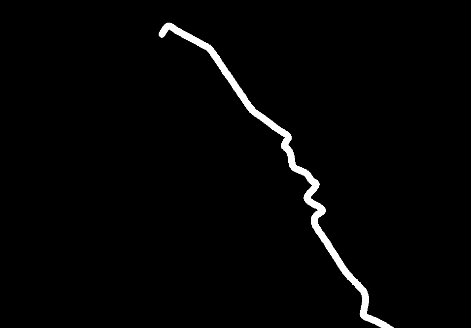

## 합성 데이터 추가
지난 포스터인 ["마라톤 경로 추출의 한계점"](2026-05-13.md)에서 언급했듯이, 데이터의 다양성은 높은데 데이터 수는 충분하지 않다는 점이 모델의 성능을 제한하는 주요 원인 중 하나라고 판단했다. 따라서, 데이터의 다양성을 높이기 위해 합성 데이터를 추가하여 학습을 진행해보기로 했다.

합성 데이터는 임의로 지도 위에 경로를 그려서 생성했으며, 실제 마라톤 경로와 유사한 형태를 가지도록 설계했다. 이를 통해 모델이 다양한 경로 패턴을 학습할 수 있도록 했다.

    <figure style="margin: 0; text-align: center;">
        
    </figure>
    <figure style="margin: 0; text-align: center;">
        
    </figure>
    <figure style="margin: 0; text-align: center;">
        
    </figure>
    <figure style="margin: 0; text-align: center;">
        
    </figure>

## U-Net의 한계

## 학습 결과

## 결론

[Project Source Code](https://github.com/sunuk00/capstone-design)