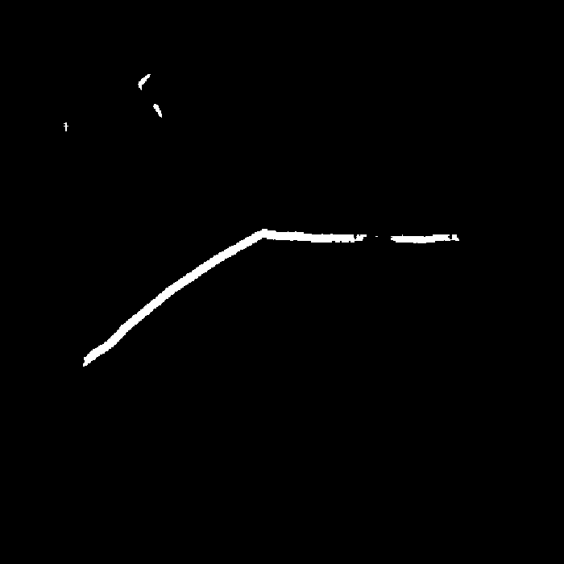
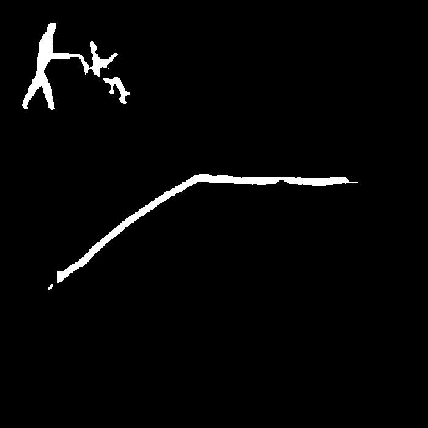
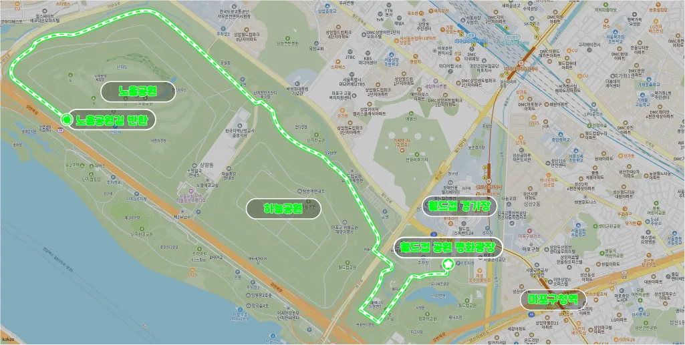
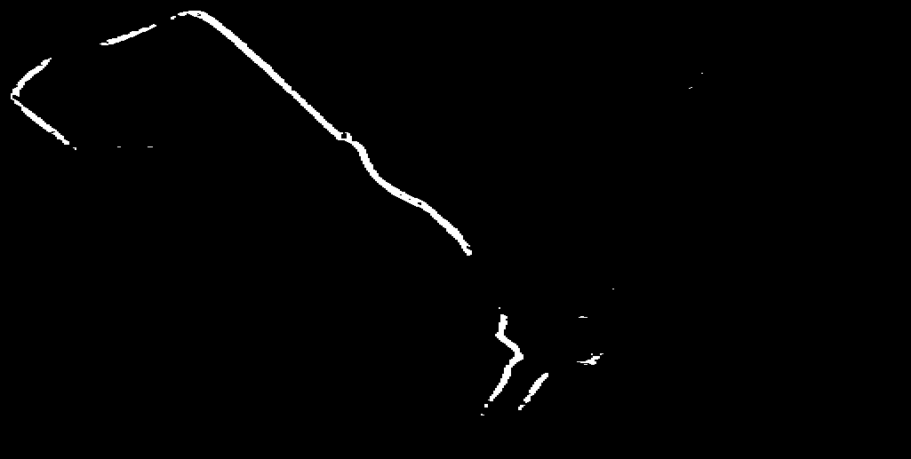
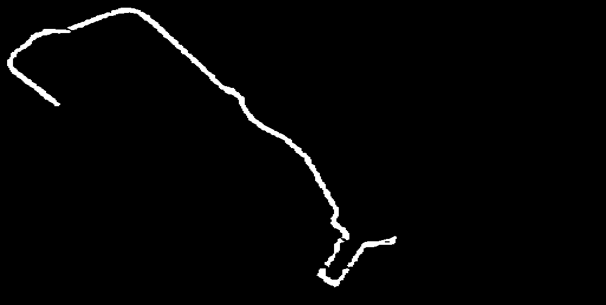
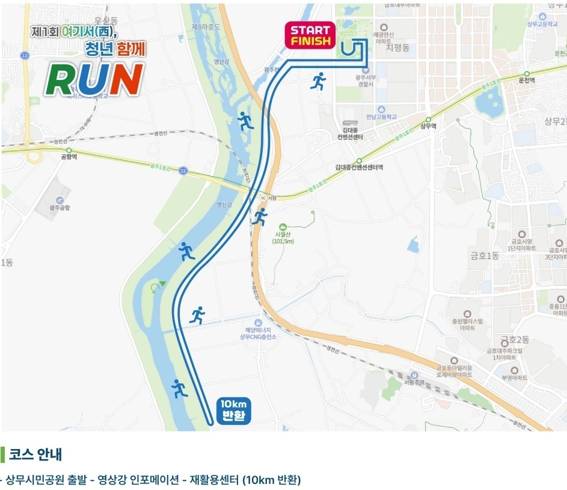
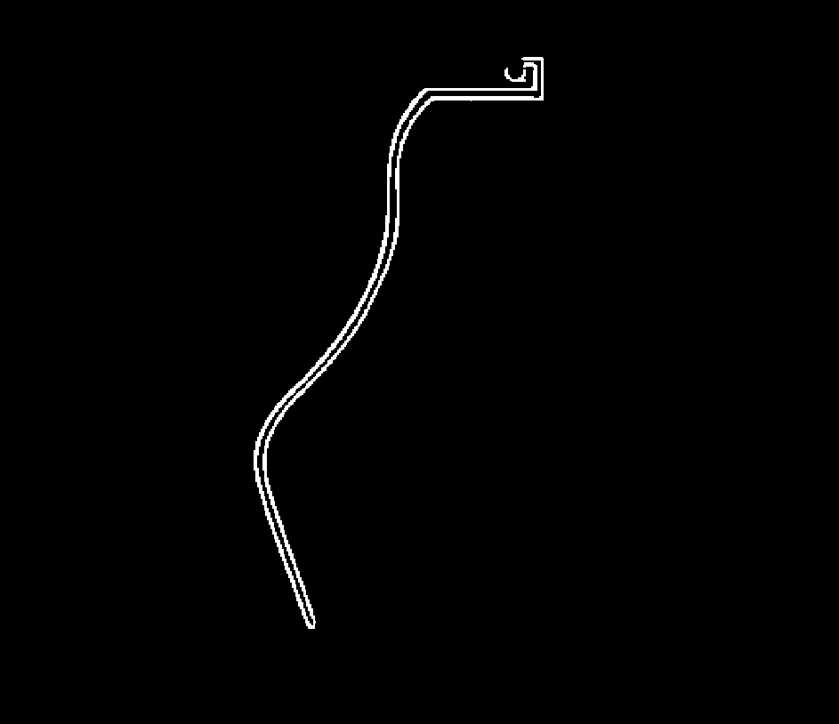
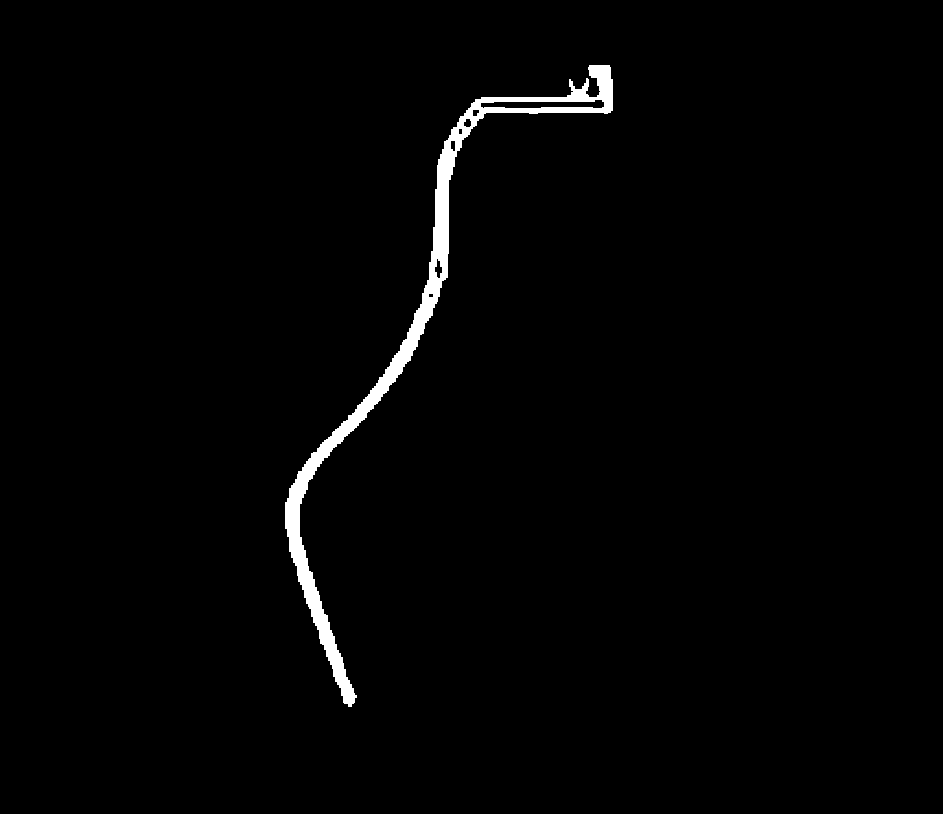

## 개요
지금까지는 U-Net 모델을 활용하여 마라톤 경로를 segment하고자 했다. 그러나 U-Net은 CNN 기반 인코더의 특성상 수용 영역이 제한적이어서, 이미지 전체에 걸쳐 이어지는 경로의 전체적인 맥락을 파악하는 데 한계가 있었다.

SegFormer는 Vision Transformer(ViT) 기반의 MiT 인코더를 통해 Self-Attention으로 이미지 전체의 맥락을 한 번에 파악할 수 있다는 강점이 있다. 이를 활용하여 마라톤 경로 이미지로부터 경로를 segment해보고자 한다.

다만 Transformer 계열 모델은 CNN의 inductive bias가 없어서, 데이터가 충분하지 않으면 패턴을 학습하기 어렵다는 단점이 있다. 실제로 기존 200장의 데이터셋으로 학습했을 때는 좋은 성능을 보이지 못했지만, 합성 데이터를 추가하여 약 800장으로 늘린 후에는 괜찮은 성능을 보였다.

정성적인 실험 결과를 바탕으로 평가했지만, 이 과정만으로도 SegFormer의 장단점을 파악하기에 충분했다고 생각한다.

SegFormer에 대해 더 알고 싶다면: ["SegFormer 논문 리뷰"](https://sunuk00.github.io/Papers/2026-04-01-SegFormer.html)

## 실험 결과
SegFormer-b2 모델을 Focal Loss를 활용하여 학습시킨 후, 테스트 데이터셋에 대해 예측한 결과이다. 

U-Net과 비교했을 때, SegFormer는 경로의 전체적인 맥락을 더 잘 파악하여, 경로가 끊기지 않고 이어지는 모습을 보여주었다. 물론 Noise가 있는 경우도 있고, 자잘하게 경로가 끊겨 있는 경우도 있지만, 분명히 SegFormer가 U-Net보다 경로의 전체적인 맥락을 더 잘 파악하고 있다는 것을 확인할 수 있었다.

    <figure style="margin: 0; text-align: center;">
        
        <figcaption>원본 마라톤 경로 이미지</figcaption>
    </figure>
    <figure style="margin: 0; text-align: center;">
        
        <figcaption>U-Net 출력</figcaption>
    </figure>
    <figure style="margin: 0; text-align: center;">
        
        <figcaption>SegFormer 출력</figcaption>
    </figure>

 

    <figure style="margin: 0; text-align: center;">
        
        <figcaption>원본 마라톤 경로 이미지</figcaption>
    </figure>
    <figure style="margin: 0; text-align: center;">
        
        <figcaption>U-Net 출력</figcaption>
    </figure>
    <figure style="margin: 0; text-align: center;">
        
        <figcaption>SegFormer 출력</figcaption>
    </figure>

## 한계점
SegFormer는 경로의 전체적인 맥락을 잘 파악하지만, 얇고 세밀한 경로를 복원하는 데에는 한계가 있었다. 원인은 크게 두 가지로 분석된다.

첫째, SegFormer의 MLP 디코더는 단순한 구조로 설계되어 있으며, H/4 해상도에서 bilinear upsampling으로 원본 크기를 복원한다. 이 과정에서 경계 정보가 손실되어 얇은 선을 세밀하게 복원하기 어렵다.

둘째, U-Net은 Skip Connection을 통해 인코더에서 추출한 저레벨 feature map을 디코더에 직접 연결함으로써 localization accuracy를 향상시킨다. 반면 SegFormer는 이러한 구조를 가지지 않아, 인코더가 의미론적 맥락 파악에 집중하는 만큼 픽셀 단위의 세밀한 경계 복원 능력은 상대적으로 약하다.

아래의 결과를 보면, SegFormer가 U-Net과는 반대로 굉장히 얇은 선을 세밀하게 segment하는 것에 대해 어려움을 겪는 것을 알 수 있다.

    <figure style="margin: 0; text-align: center;">
        
        <figcaption>원본 마라톤 경로 이미지</figcaption>
    </figure>
    <figure style="margin: 0; text-align: center;">
        
        <figcaption>U-Net 출력</figcaption>
    </figure>
    <figure style="margin: 0; text-align: center;">
        
        <figcaption>SegFormer 출력</figcaption>
    </figure>

## 결론
사실 SegFormer를 우리 캡스톤 모델로 채택하기에는 한계가 있다. GPX(GPS 정보)를 생성하는 것이 결국 최종 목적이기에, 정확하고 세밀한 경로 추출이 굉장히 중요한 과제이다. 나는 이 문제를 해결하기 위해 SegFormer의 Encoder와 U-Net의 Decoder를 결합한 SegFormerUNet 모델을 설계하고자 한다. SegFormer의 Encoder는 경로의 전체적인 맥락을 잘 파악하고, U-Net의 Decoder는 경로의 세밀한 부분을 잘 예측할 수 있기 때문이다.

[Project Source Code](https://github.com/sunuk00/capstone-design)

## References
[[논문리뷰] SegFormer: Simple and Efficient Design for SemanticSegmentation with Transformers](https://lcyking.tistory.com/entry/%EB%85%BC%EB%AC%B8%EB%A6%AC%EB%B7%B0-SegFormer-Simple-and-Efficient-Design-for-SemanticSegmentation-with-Transformers)