## 개요
AI 모델이 완벽하게 내가 원하는대로 마라톤 경로 이미지로부터 경로를 예측해주면 좋겠지만, 사실상 그것은 지금의 나의 역량으로는 굉장히 힘들다는 것을 체감해버렸다. 즉, 모델이 출력한 이미지를 후처리하는 방식을 도입해야만 한다.

후처리를 해야하는 경우는 다음과 같다:
1. 모델이 예측한 경로가 끊어져 있는 경우
2. 모델이 예측한 이미지에 노이즈가 있는 경우

<div style="display: flex; gap: 20px; justify-content: center;">
    <figure style="margin: 0; text-align: center;">
        
        <figcaption>원본 마라톤 경로 이미지</figcaption>
    </figure>
    <figure style="margin: 0; text-align: center;">
        
        <figcaption>모델이 예측한 이미지</figcaption>
    </figure>
</div>

## 후처리 전에 고려해야할 점
마라톤 경로 추출 모델의 결과는 완벽하지 않다.
모델이 예측한 마스킹 이미지에는 크고 작은 노이즈가 포함될 수 있으며, 실제 경로가 일부 끊겨 예측되는 경우도 존재한다. 그리고 이러한 문제를 단순히 규칙 기반으로 후처리하는 것은 한계가 있다.

예를 들어 다음과 같은 다양항 상황이 발생할 수 있다:
* 실제 경로이지만, 노이즈보다 더 작은 크기로 예측된 경우
* 실제 경로이지만 주경로와 멀리 떨어져 있는 경우
* 노이즈이지만 주경로와 가까운 위치에 존재하는 경우
* 노이즈이지만 주경로와 유사한 방향성을 가지는 경우

등등, 이처럼 경로와 노이즈를 명확한 규칙만으로 완전히 구분하기는 어렵기 때문에, 모든 경우를 처리할 수 있는 완벽한 후처리 규칙을 설계하는 것은 내 현재 역량으로는 굉장히 한계가 존재한다.

따라서 나는 "모델이 최소 수준 이상의 예측 성능을 보장한다"는 가정을 기반으로 후처리를 수행하고자 한다. 즉, 모델이 생성한 마스킹 이미지가 전체적인 경로 구조를 어느 정도 올바르게 예측하고 있으며, 노이즈 또한 제한적인 수준에서 발생한다는 것을 전제로 한다.

이를 바탕으로 후처리 단계에서는 다음 두 가지 문제를 해결하는 것을 목표로 한다:
1. 마스킹 이미지에 포함된 작은 노이즈 제거
2. 짧은 거리 내에 끊어진 주경로 복원


## Post-Processing
내가 생각해본 후처리는 크게 다음과 같다:
1. 전체 연결 요소를 크기 기준으로 정렬
2. 가장 큰 것 = 주경로로 확정
3. 노이즈를 제거
4. 주경로와 나머지 파편들을 연결


### Connected Component 탐색 + 주경로 선택
이진 마스크에서 서로 연결된 픽셀들의 덩어리 하나를 "Connected Component(CC)"라고 한다. 

```
0 0 1 1 0 0 1
0 1 1 0 0 1 1   → CC #1 (왼쪽 덩어리), CC #2 (오른쪽 덩어리)
0 0 1 0 0 1 0
```

모든 CC를 찾은 뒤에는 각 CC의 픽셀 개수를 계산하여 크기 기준으로 정렬한다. 가장 큰 CC는 주경로로 확정한다.


<div style="display: flex; gap: 20px; justify-content: center;">
    <figure style="margin: 0; text-align: center;">
        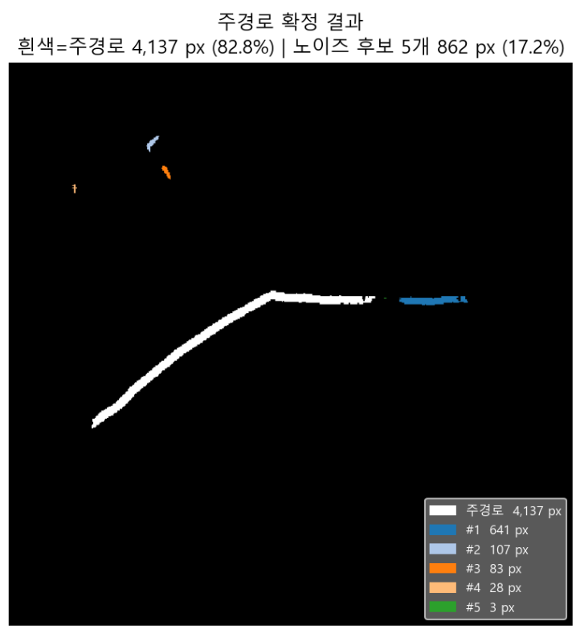
        <figcaption></figcaption>
    </figure>
    <figure style="margin: 0; text-align: center;">
        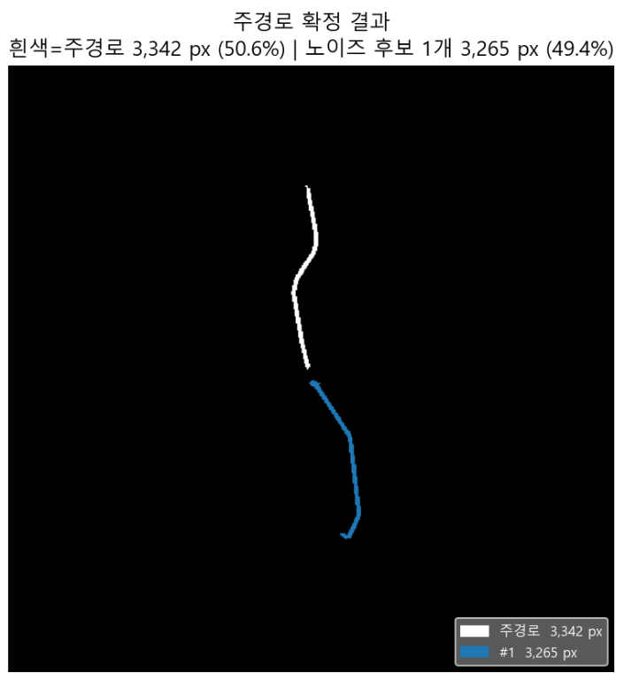
        <figcaption></figcaption>
    </figure>
    <figure style="margin: 0; text-align: center;">
        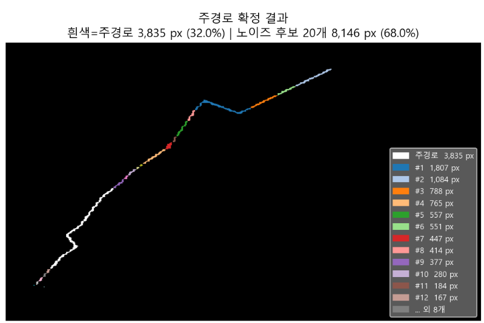
        <figcaption></figcaption>
    </figure>
</div>


### 형태 기반 노이즈 제거 
노이즈를 제거 할 때, 단순히 크기 기준으로 제거한다면, 실제 경로이지만 작은 크기로 예측된 CC도 함께 제거될 수 있다. 그래서 형태 기반으로 노이즈를 제거하는 방법을 시도했다.

Area(픽셀 수), Circularity(원형도), Skeleton Length(스켈레톤 길이)로 총 세 가지 형태 기반 지표를 계산하여, 노이즈로 판단되는 CC를 제거하는 방식이다.

만약 세 가지 지표가 모두 특정 임계값을 만족한다면, 해당 CC는 노이즈로 생각하고 제거한다.

우리가 직접 설정해주어야 하는 임계값은 다음과 같다:
* **`area_thresh`**: CC의 픽셀 수가 이 값보다 작으면 노이즈로 제거
* **`circ_thresh`**: CC의 원형도가 이 값보다 크면 노이즈로 제거 (0~1 사이의 값, 1에 가까울수록 원형)
* **`skel_thresh`**: CC의 스켈레톤 길이가 이 값보다 작으면 노이즈로 제거 (실제 경로는 일반적으로 긴 형태이므로, 짧은 스켈레톤을 가진 CC는 노이즈일 가능성이 높음)

``` python
if (area < area_thresh
        and circularity > circ_thresh
        and skeleton_length < skel_thresh):
    → 노이즈로 제거
```

<div style="display: flex; gap: 20px; justify-content: center;">
    <figure style="margin: 0; text-align: center;">
        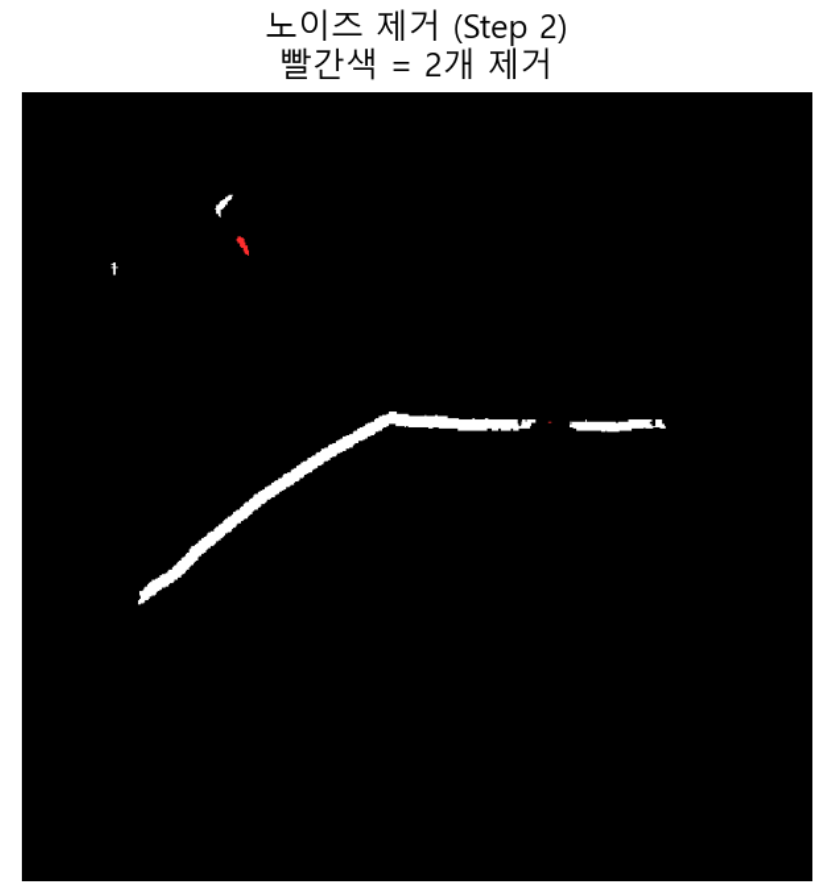
        <figcaption>노이즈 제거</figcaption>
    </figure>
    <figure style="margin: 0; text-align: center;">
        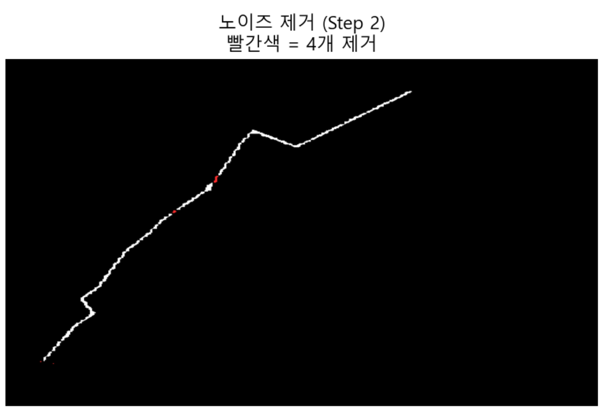
        <figcaption>노이즈 제거</figcaption>
    </figure>
</div>


### Iterative Fragment Connection
경로를 연결하기 위해서는 먼저 "어디와 어디를 이어야 하는지"를 알아야 한다. 이를 위해 사용되는 것이 Endpoint다. Endpoint는 스켈레톤 상에서 더 이상 이어질 픽셀이 없는 "경로의 끝부분"을 의미한다.

이 작업에서는 끊긴 경로 조각들을 하나씩 이어 붙인다. 항상 주경로를 기준으로 fragment 방향으로만 연결한다. 즉, fragment ↔ fragment는 하지 않는다. 매 반복마다 가장 가까운 fragment 하나만 연결하고 CC를 다시 계산한다.

여기서 우리가 설정해주어야 하는 임계값은 다음과 같다:
* **`max_distance`**: 주경로 endpoint와 fragment endpoint 사이의 거리가 이 값보다 작으면 연결, 이 값보다 크면 중단

알고리즘 흐름은 다음과 같다:
```
반복:
    1. CC 계산 → 가장 큰 덩어리 = 주경로
    2. 주경로의 endpoint 탐색
    3. 각 fragment의 endpoint 탐색
    4. 주경로 endpoint ↔ fragment endpoint 최소 거리 탐색
    5. 거리 < max_distance → 연결
    6. 거리 ≥ max_distance → 중단
```

<div style="display: flex; gap: 20px; justify-content: center;">
    <figure style="margin: 0; text-align: center;">
        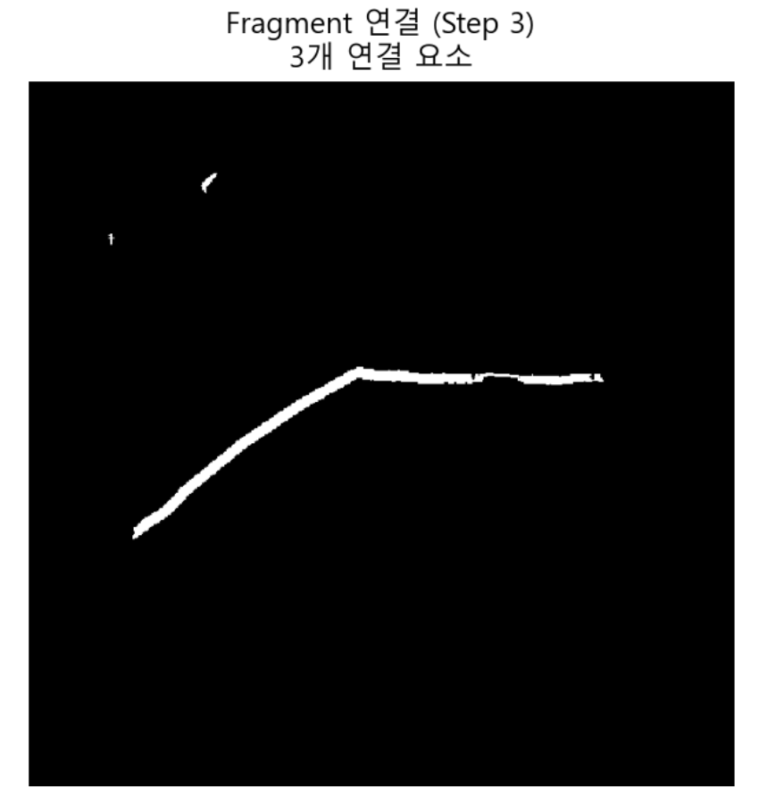
        <figcaption>Fragment Connection</figcaption>
    </figure>
    <figure style="margin: 0; text-align: center;">
        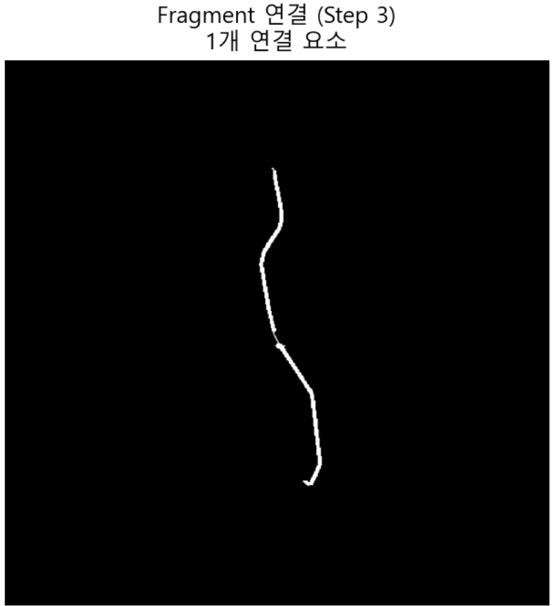
        <figcaption>Fragment Connection</figcaption>
    </figure>
    <figure style="margin: 0; text-align: center;">
        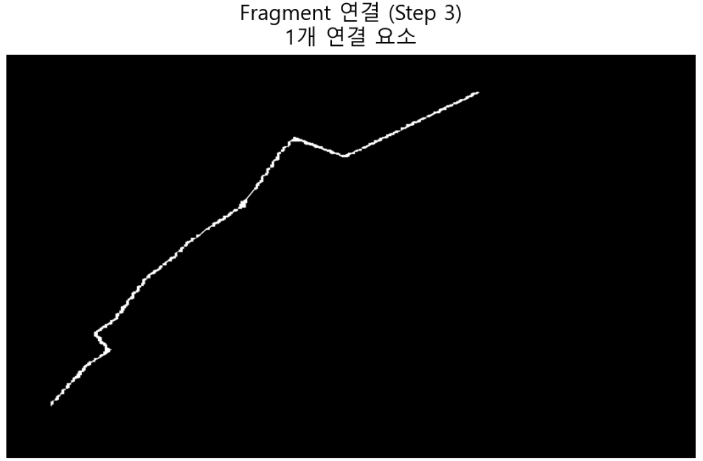
        <figcaption>Fragment Connection</figcaption>
    </figure>
</div>

<br>

당연히 모든 경로가 항상 endpoint를 가지는 것은 아니다. 만약 선이 동그랗게 이어져 있다면, 시작도 끝도 없는 형태가 될 수 있다. 이러한 문제를 대비하여 두 가지 예외 처리를 추가했다:

1. 만약 끝점이 하나도 없는 동그라미 같은 모양이면, Skeleton 전체 픽셀 중 가장 가까운 아무 점이나 끝점 후보로 사용한다.
2. 만약 Skeleton을 추출할 수 없을 만큼 작은 조각이라면, 해당 조각의 모든 픽셀을 끝점 후보로 사용하여 연결을 시도한다.

### 잔여 Fragment 제거
모든 연결이 끝난 뒤에도 여전히 주경로와 연결되지 않은 작은 조각들이 남아 있을 수 있다. 이러한 조각들은 노이즈일 가능성이 높으므로 제거한다.


<div style="display: flex; gap: 20px; justify-content: center;">
    <figure style="margin: 0; text-align: center;">
        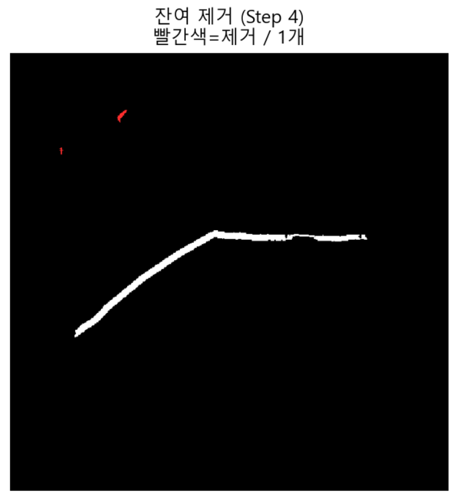
        <figcaption>잔여 Fragment 제거</figcaption>
    </figure>
</div>


## 최종 결과
이제 후처리가 된 경로를 스켈레톤화를 시켜서 픽셀 리스트를 뽑아야 하는데, 그 과정을 시각화하면 다음과 같다:
<div style="display: flex; gap: 20px; justify-content: center;">
    <figure style="margin: 0; text-align: center;">
        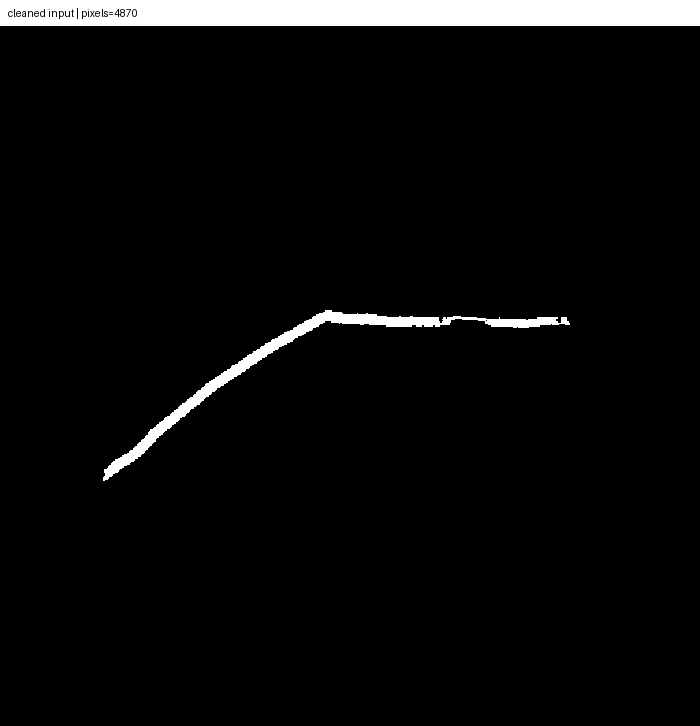
        <figcaption></figcaption>
    </figure>
    <figure style="margin: 0; text-align: center;">
        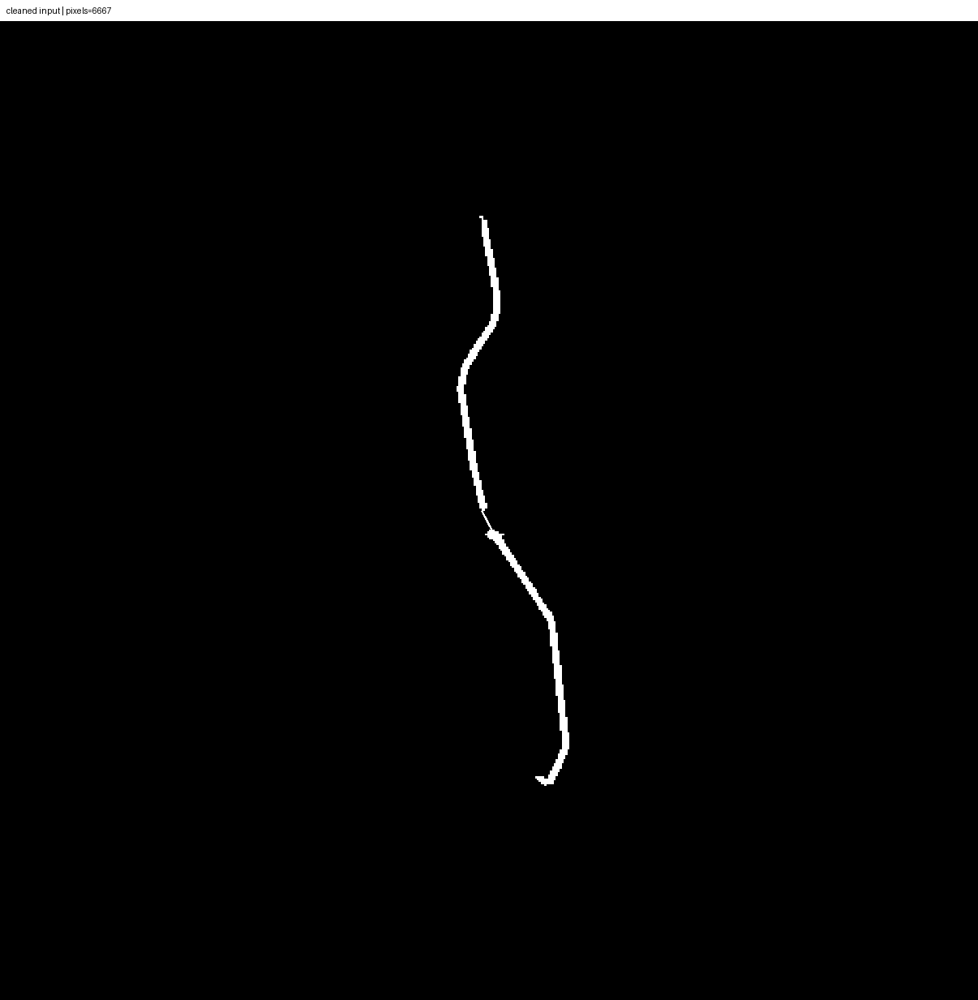
        <figcaption></figcaption>
    </figure>
    <figure style="margin: 0; text-align: center;">
        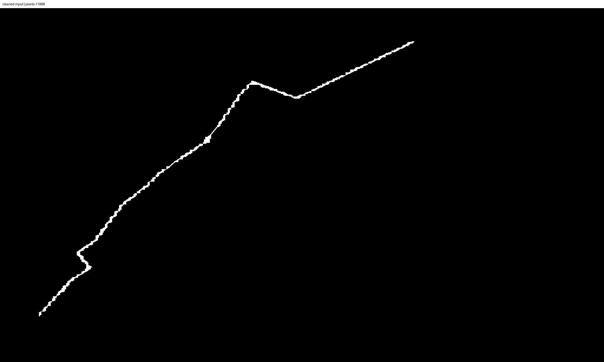
        <figcaption></figcaption>
    </figure>
</div>

아무래도 잔가지를 좀 제거해야할 필요가 있어보인다.

## 결론
현재 후처리에는 사용자가 직접 설정해줘야하는 여러 임계값이 존재한다:
* `area_thresh`
* `circ_thresh`
* `skel_thresh`
* `max_distance`

나는 각각 250px, 0.5, 400px, 150px로 설정을 했지만, 이건 어디까지나 내 경험으로 얻은 값일뿐, 다른 데이터셋이나 모델에서는 최적의 성능을 위해 다른 값이 필요할 수 있다.

이처럼 후처리 단계에서 모델의 예측 결과를 개선하기 위해서는 여러 가지 임계값을 조정해야 하는데, 이러한 임계값들은 모델의 예측 성능에 크게 의존한다. 만약 모델이 너무 많은 노이즈를 포함하거나, 실제 경로를 너무 작은 조각으로 예측한다면, 후처리 단계에서 적절한 임계값을 찾기가 매우 어려워진다.

**따라서 최소한의 모델 성능이 보장되는 것이 중요하다.**

[Project Source Code](https://github.com/sunuk00/capstone-design)